# 源代码分析与设计文档

**分析代码路径:** bevy-origin\crates\bevy_app

**文档版本:** 1.0
**最后更新:** 2025年

---

## 前言：代码映射索引 (Code-to-Doc Map)

本文档分析了 Bevy 游戏引擎的核心应用层模块 `bevy_app`，该模块提供了应用程序生命周期管理、插件系统和调度机制的完整实现。

| 设计概念 | 源文件位置 | 核心类型 |
|---------|-----------|---------|
| 主应用程序容器 | `src/app.rs` | `App`, `AppExit` |
| 子应用程序系统 | `src/sub_app.rs` | `SubApp`, `SubApps` |
| 插件架构 | `src/plugin.rs` | `Plugin`, `Plugins`, `PluginsState` |
| 插件组管理 | `src/plugin_group.rs` | `PluginGroup`, `PluginGroupBuilder` |
| 主调度系统 | `src/main_schedule.rs` | `Main`, `MainScheduleOrder`, 各阶段调度标签 |
| 调度运行器 | `src/schedule_runner.rs` | `ScheduleRunnerPlugin`, `RunMode` |
| 层级属性传播 | `src/propagate.rs` | `HierarchyPropagatePlugin`, `Propagate<C>` |
| 任务池管理 | `src/task_pool_plugin.rs` | `TaskPoolPlugin`, `TaskPoolOptions` |
| 异常处理 | `src/panic_handler.rs` | `PanicHandlerPlugin` |
| 终端信号处理 | `src/terminal_ctrl_c_handler.rs` | `TerminalCtrlCHandlerPlugin` |
| 库入口 | `src/lib.rs` | 模块导出与预导入 |

---

## 1. 系统概述 (System Overview)

### 1.1. 核心功能与目的

`bevy_app` 是 Bevy 引擎的应用层核心，负责：

1. **应用生命周期管理**：提供从启动到关闭的完整应用程序生命周期控制
2. **插件系统架构**：实现高度模块化的插件注册、构建、初始化和清理机制
3. **调度编排**：管理多个调度阶段的执行顺序，支持启动阶段、固定时间步和帧更新阶段
4. **子应用程序支持**：允许创建独立的子应用程序环境（如渲染线程、物理模拟等）
5. **并发任务管理**：配置和管理异步计算、IO和计算任务池
6. **跨平台抽象**：提供统一的运行时接口，支持桌面、Web和移动平台

### 1.2. 技术栈

- **语言**: Rust（2024 edition）
- **无标准库支持**: 使用 `#![no_std]` 设计，通过 feature flags 选择性启用标准库
- **核心依赖**:
  - `bevy_ecs`: 实体组件系统，提供世界管理和调度能力
  - `bevy_reflect`: 运行时反射系统（可选）
  - `bevy_tasks`: 异步任务池和并发原语
  - `bevy_platform`: 平台抽象层
- **设计特性**:
  - 零成本抽象：通过泛型和内联实现性能最大化
  - 类型状态模式：在编译期保证状态机正确性
  - 构建器模式：提供流畅的 API 接口

### 1.3. 关键依赖

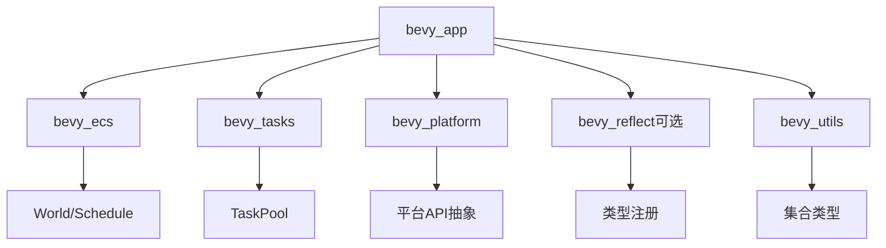

**依赖说明**：
- **bevy_ecs**：提供世界状态管理、系统调度、资源管理和事件系统
- **bevy_tasks**：提供异步任务执行能力，支持多线程并行计算
- **bevy_platform**：抽象不同平台的线程、时间、同步原语
- **bevy_reflect**：可选的运行时类型信息和反射能力
- **downcast-rs**：支持 trait 对象的向下转型
- **variadics_please**：实现元组式 API 的宏支持

---

## 2. 架构分析 (Architectural Analysis)

### 2.1. 代码库结构 (Codebase Architecture)

```
bevy_app/
├── src/
│   ├── lib.rs                      # 模块入口与功能导出
│   ├── app.rs                      # 主应用程序结构（约2000行）
│   ├── sub_app.rs                  # 子应用程序实现（约540行）
│   ├── plugin.rs                   # 插件trait和状态机（约195行）
│   ├── plugin_group.rs             # 插件组和构建器（约906行）
│   ├── main_schedule.rs            # 主调度定义（约491行）
│   ├── schedule_runner.rs          # 调度运行器（约176行）
│   ├── propagate.rs                # 层级属性传播系统（约584行）
│   ├── task_pool_plugin.rs         # 任务池插件（约297行）
│   ├── panic_handler.rs            # 异常处理器（约62行）
│   └── terminal_ctrl_c_handler.rs  # 终端信号处理（约74行）
├── Cargo.toml                      # 依赖配置
└── README.md
```

**模块职责分层**：

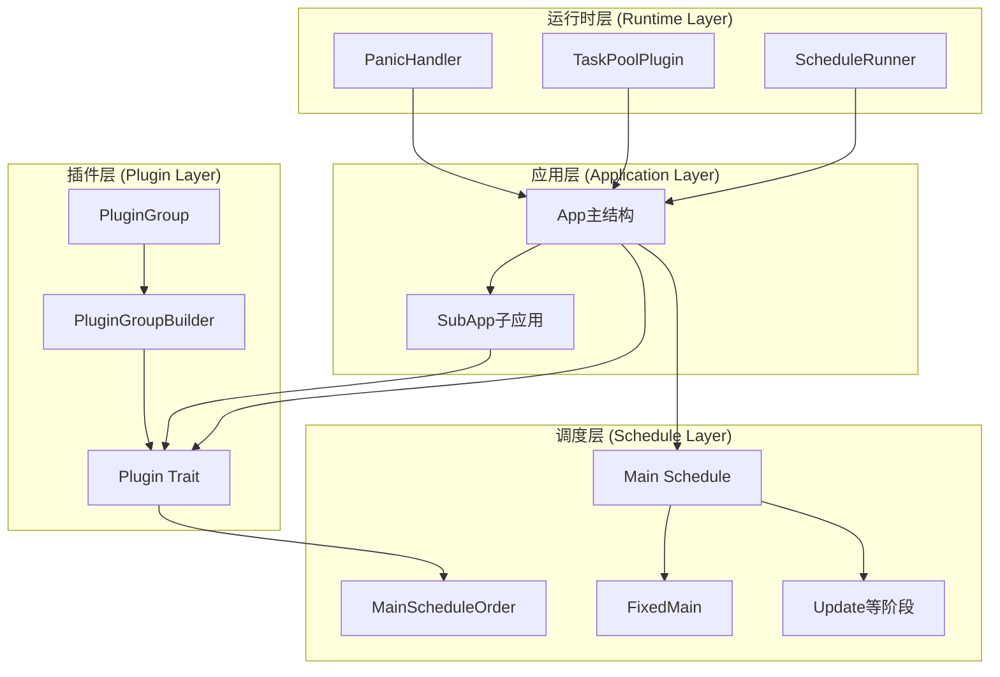

### 2.2. 运行时架构 (Runtime Architecture)

Bevy 应用的运行时采用分层调度架构，通过主循环驱动多个调度阶段的有序执行。

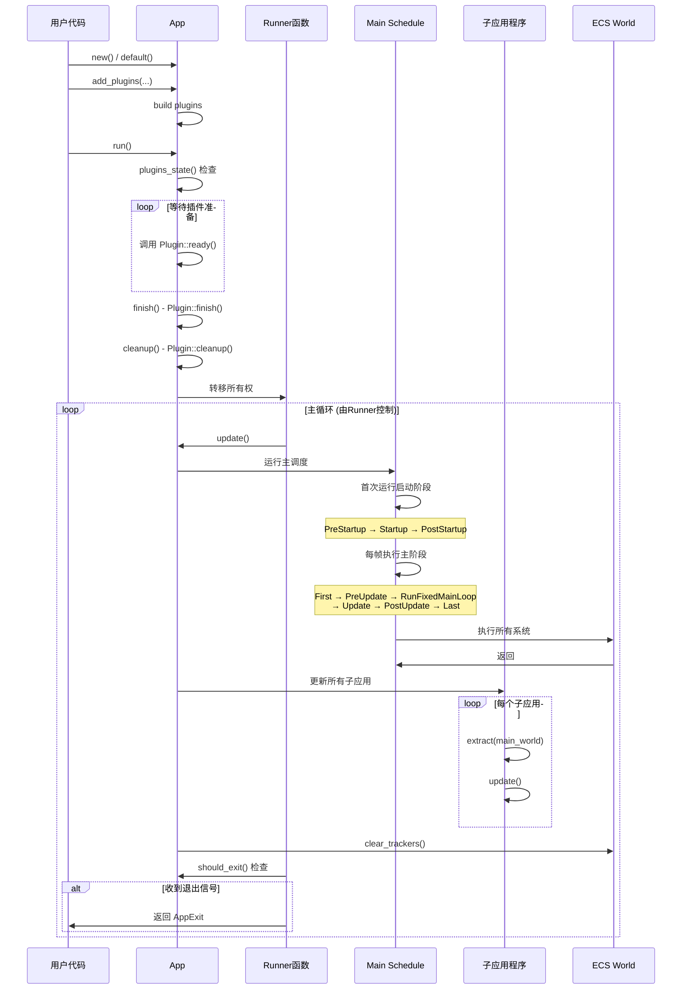

**关键流程说明**：

1. **构建阶段**：用户通过流畅 API 配置应用，添加插件、系统和资源
2. **插件初始化**：按依赖顺序构建插件，支持异步准备阶段
3. **运行时转移**：应用所有权移交给 Runner 函数，进入主循环
4. **调度执行**：主调度按预定义顺序运行所有系统，支持并行执行
5. **子应用同步**：每帧从主世界提取数据到子应用，独立更新
6. **变更追踪清理**：每帧结束清理 ECS 的变更检测标记

### 2.3. 核心设计模式

#### 2.3.1 构建器模式 (Builder Pattern)

`App` 和 `PluginGroupBuilder` 广泛使用构建器模式，提供流畅的 API：

**特点**：
- 方法链式调用，返回 `&mut self` 实现连续配置
- 分阶段构建：配置阶段 → 准备阶段 → 完成阶段
- 延迟验证：在 `run()` 时才执行最终检查

**应用示例**：
```rust
// 伪代码展示 API 风格
App::new()
    .add_plugins(DefaultPlugins)
    .add_systems(Update, my_system)
    .insert_resource(MyResource)
    .run();
```

#### 2.3.2 类型状态模式 (Typestate Pattern)

插件系统通过枚举类型 `PluginsState` 实现状态机：

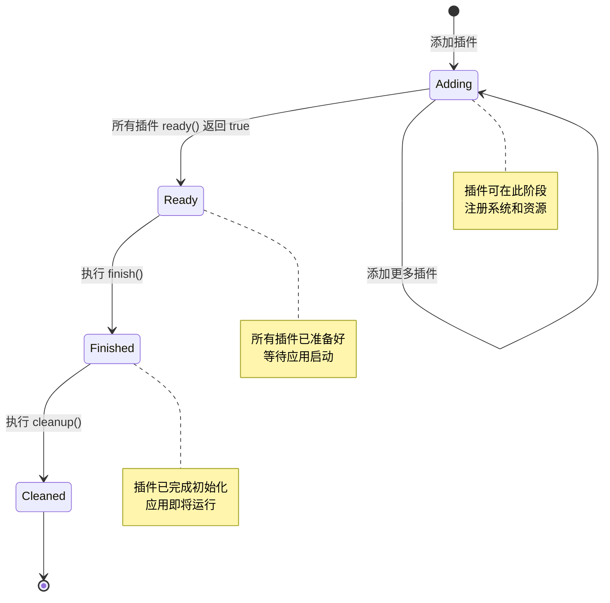

**状态约束**：
- 只能在 `Adding` 状态添加新插件
- 必须按顺序转换，不可跳过状态
- 每个状态转换调用对应的 Plugin 生命周期方法

#### 2.3.3 Trait 对象与类型擦除

插件系统使用 trait 对象存储异构插件：

**设计要点**：
- `Box<dyn Plugin>` 存储：允许不同具体类型的插件统一管理
- `Downcast` trait：支持运行时类型查询和转换
- 类型名称映射：通过 `plugin_names: HashSet<String>` 防重复

#### 2.3.4 层次化调度 (Hierarchical Scheduling)

通过嵌套调度实现复杂的执行控制：

```
Main Schedule (单线程执行器)
├── PreStartup (首次运行)
├── Startup (首次运行)
├── PostStartup (首次运行)
└── 主循环
    ├── First
    ├── PreUpdate
    ├── RunFixedMainLoop (单线程执行器)
    │   ├── BeforeFixedMainLoop (变时间步系统)
    │   ├── FixedMain (单线程执行器)
    │   │   ├── FixedFirst
    │   │   ├── FixedPreUpdate
    │   │   ├── FixedUpdate (固定时间步逻辑)
    │   │   ├── FixedPostUpdate
    │   │   └── FixedLast
    │   └── AfterFixedMainLoop (变时间步系统)
    ├── Update
    ├── SpawnScene
    ├── PostUpdate
    └── Last
```

**设计优势**：
- **时间步分离**：固定时间步逻辑（物理、网络）与渲染解耦
- **依赖管理**：通过阶段顺序隐式管理系统依赖
- **可扩展性**：插件可在任意阶段前后插入自定义调度

#### 2.3.5 观察者模式 (Observer Pattern)

子应用程序通过提取函数实现数据同步：

**机制**：
- 主应用维护全局状态（主 World）
- 子应用注册提取函数：`fn(&mut World, &mut World)`
- 每帧自动调用提取函数，从主世界复制数据到子世界

**应用场景**：
- 渲染子应用：提取可见组件数据
- 物理子应用：提取变换和碰撞组件
- 网络子应用：提取需要同步的实体状态

---

## 3. 执行流与生命周期 (Execution Flow & Lifecycle)

### 3.1. 应用入口与启动流程

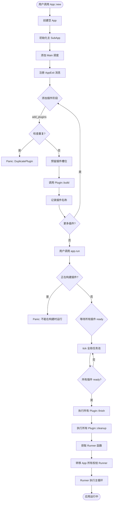

**关键步骤详解**：

1. **默认初始化** (`App::default`):
   - 创建主 `SubApp` 并设置其更新调度为 `Main`
   - 注册类型反射系统（如果启用 `bevy_reflect` feature）
   - 添加 `MainSchedulePlugin` 初始化所有内置调度
   - 在 `First` 阶段注册消息更新系统
   - 注册 `AppExit` 消息类型用于退出信号

2. **插件构建阶段**:
   - 插件按添加顺序依次构建，支持插件内部添加更多插件
   - 使用占位符机制确保插件顺序：先在注册表中预留位置，构建完成后替换
   - 增量计数 `plugin_build_depth` 防止递归时运行应用
   - 捕获 panic 并记录插件名称后重新抛出（仅标准库环境）

3. **插件准备循环**:
   - 轮询所有插件的 `ready()` 方法，直到全部返回 `true`
   - 每次循环调用 `tick_global_task_pools_on_main_thread()` 推进异步任务
   - 这一阶段允许插件进行异步初始化（如加载资源、建立网络连接）

4. **最终化阶段**:
   - `finish()`: 插件完成最终配置，可访问其他插件的状态
   - `cleanup()`: 插件执行清理逻辑，例如将资源移动到其他线程

5. **所有权转移**:
   - 通过 `mem::replace` 将 `App` 的所有权转移给 `Runner` 函数
   - `Runner` 是一个 `FnOnce(App) -> AppExit` 的闭包
   - 转移后原 `App` 对象被替换为空应用，防止误用

### 3.2. 应用运行周期

#### 3.2.1 Main Schedule 执行流程

`Main` 调度是应用的心跳，每次 `app.update()` 时执行：

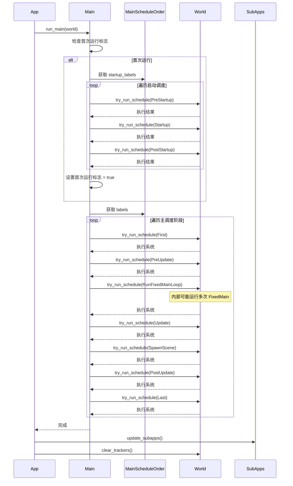

**执行特性**：
- **启动调度**：只在第一次执行，用于初始化资源和生成初始实体
- **单线程执行器**：`Main` 和 `FixedMain` 使用单线程执行器，避免调度开销
- **可配置顺序**：通过 `MainScheduleOrder` 资源动态插入或重排调度

#### 3.2.2 固定时间步调度 (FixedMain)

固定时间步调度在 `RunFixedMainLoop` 阶段执行，确保物理和游戏逻辑的确定性：

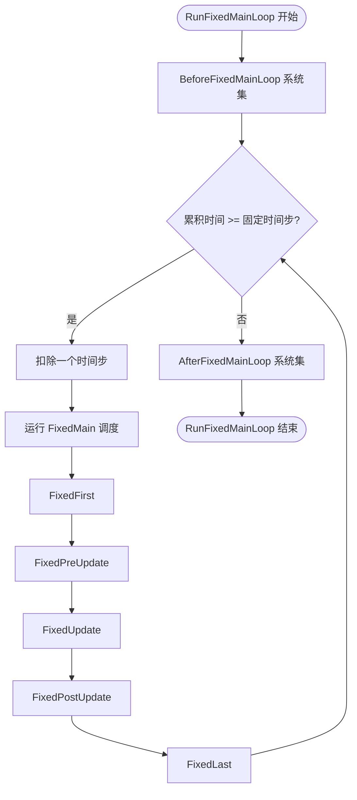

**时间步控制**：
- 默认频率：64 Hz（约 15.625ms 每帧）
- 通过 `Time<Fixed>` 资源配置频率
- 超调处理：累积时间过多时执行多次固定更新
- 补偿机制：通过 `Time::overstep()` 获取未消耗的剩余时间

**系统放置指南**：
- `FixedUpdate`: 物理模拟、AI决策、网络同步
- `BeforeFixedMainLoop`: 读取输入、相机控制
- `AfterFixedMainLoop`: 插值、平滑处理

#### 3.2.3 子应用更新流程

子应用在主应用更新完成后执行，支持独立的世界状态：

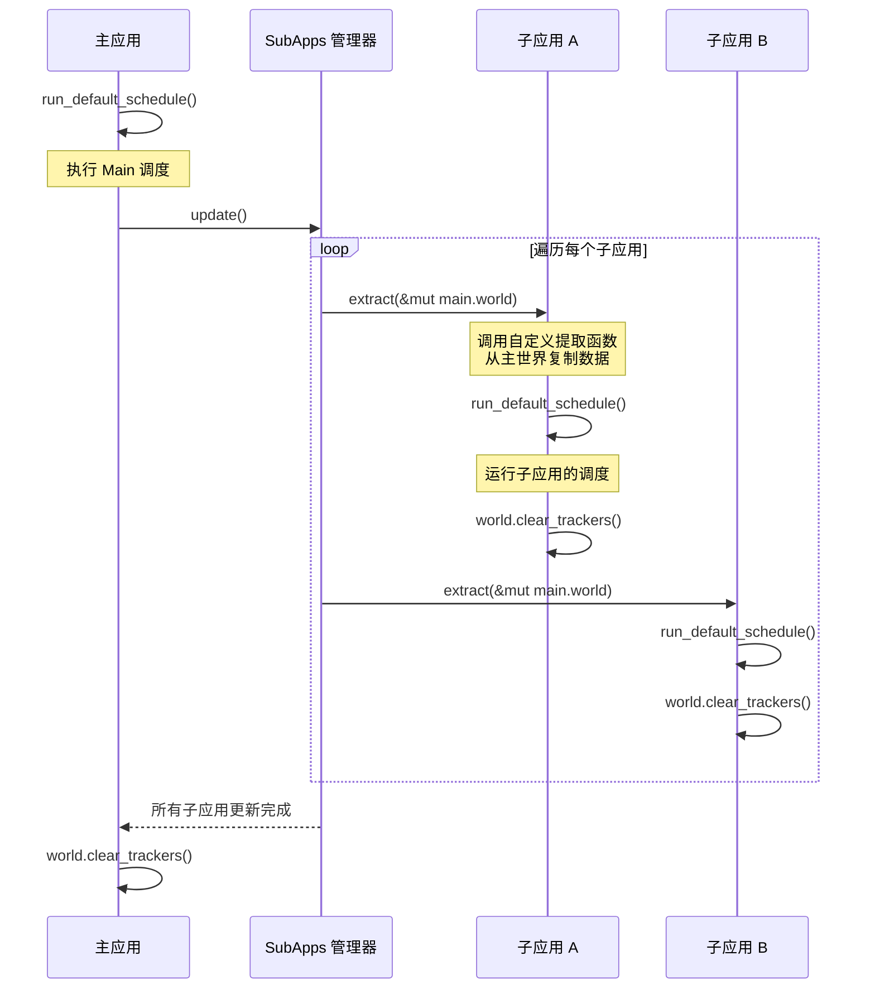

**数据隔离**：
- 每个子应用拥有独立的 `World` 实例
- 通过提取函数显式定义数据流向
- 主应用更新先于子应用，保证数据时序一致性

**应用场景**：
- **渲染子应用**：提取可见实体和变换，在独立线程渲染
- **物理子应用**：固定时间步物理模拟，与渲染帧率解耦
- **网络子应用**：提取需要同步的实体，管理网络通信

#### 3.2.4 退出流程

应用退出通过消息系统实现，支持优雅关闭：

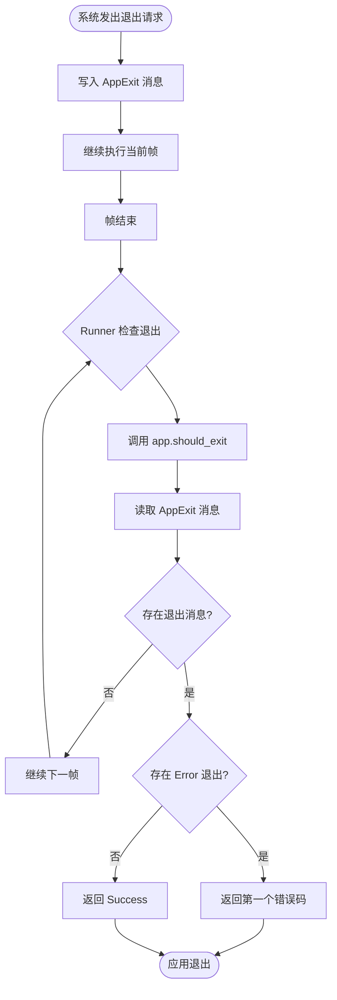

**退出类型**：
- `AppExit::Success`: 正常退出（退出码 0）
- `AppExit::Error(code)`: 错误退出（退出码 1-255）
- 多个退出消息时，优先返回错误退出

**退出来源**：
- 用户系统主动发出
- `Ctrl+C` 信号触发（通过 `TerminalCtrlCHandlerPlugin`）
- 窗口关闭事件（由 `WinitPlugin` 发出）
- 运行模式限制（`ScheduleRunnerPlugin` 的 `RunMode::Once`）

---

## 4. 核心模块/组件深度剖析

### 4.1. App - 应用容器

#### 4.1.1. 职责与边界

`App` 是 Bevy 应用的根容器，职责包括：

**核心职责**：
- 管理主 `SubApp` 和所有子应用集合
- 维护插件注册表和状态机
- 提供流畅 API 用于配置应用
- 持有 `Runner` 函数，控制应用主循环
- 管理默认错误处理器配置

**边界约束**：
- 不直接管理 ECS 世界：通过 `SubApp` 间接访问
- 不实现调度逻辑：调度由 `Schedule` 类型负责
- 不处理具体运行循环：由 `Runner` 函数或插件实现

#### 4.1.2. 关键抽象与数据结构

**核心字段**：
```rust
pub struct App {
    pub(crate) sub_apps: SubApps,              // 主应用和子应用集合
    pub(crate) runner: RunnerFn,               // 运行函数：FnOnce(App) -> AppExit
    default_error_handler: Option<ErrorHandler>, // 默认错误处理器
}

pub struct SubApps {
    pub main: SubApp,                           // 主应用（特殊子应用）
    pub sub_apps: HashMap<InternedAppLabel, SubApp>, // 命名子应用
}
```

**类型设计**：
- `RunnerFn = Box<dyn FnOnce(App) -> AppExit>`：允许自定义主循环实现
- `InternedAppLabel`：字符串驻留技术优化子应用查找
- `must_use` 属性：防止创建应用后忘记调用 `run()`

#### 4.1.3. 内部交互逻辑

**插件添加流程**：
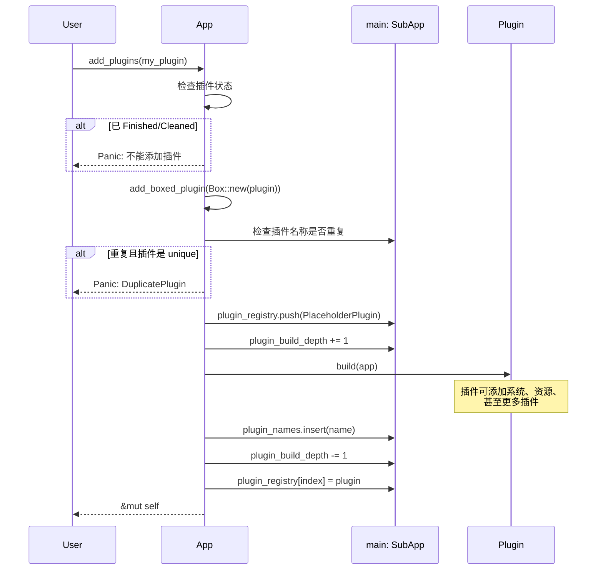

**资源访问代理**：
`App` 的大多数方法通过代理到 `main` 子应用实现：

- `world()` / `world_mut()`: 获取主世界引用
- `add_systems()`: 向主应用添加系统
- `insert_resource()`: 向主世界插入资源
- `add_schedule()`: 向主应用添加调度

这种设计将 `App` 定位为外观（Facade）模式，简化用户 API。

#### 4.1.4. 观察到的设计模式

**外观模式 (Facade Pattern)**:
- `App` 为复杂的 `SubApp`、`Plugin`、`Schedule` 子系统提供统一接口
- 隐藏子应用和插件管理的复杂性
- 提供符合直觉的流畅 API

**策略模式 (Strategy Pattern)**:
- 通过 `runner` 字段允许替换运行策略
- 默认运行器：执行一次后退出
- `ScheduleRunnerPlugin` 提供循环运行策略
- `WinitPlugin` 提供事件驱动运行策略

**注册表模式 (Registry Pattern)**:
- `plugin_registry` 存储所有已添加的插件
- `plugin_names` 快速查重
- 支持运行时查询插件是否已添加：`is_plugin_added::<T>()`

### 4.2. SubApp - 子应用容器

#### 4.2.1. 职责与边界

`SubApp` 是独立的 ECS 环境，职责包括：

**核心职责**：
- 拥有独立的 `World` 实例和资源集合
- 管理自己的调度集合和执行顺序
- 支持数据提取机制，从其他世界获取数据
- 维护自己的插件注册表和状态

**边界约束**：
- 与其他子应用隔离，不共享 World 状态
- 提取函数是唯一的数据输入通道
- 不能直接访问其他子应用的 World

#### 4.2.2. 关键抽象与数据结构

**核心字段**：
```rust
pub struct SubApp {
    world: World,                                   // 独立的 ECS 世界
    pub(crate) plugin_registry: Vec<Box<dyn Plugin>>,  // 插件列表
    pub(crate) plugin_names: HashSet<String>,       // 插件名称集合
    pub(crate) plugin_build_depth: usize,           // 插件嵌套深度
    pub(crate) plugins_state: PluginsState,         // 插件状态机
    pub update_schedule: Option<InternedScheduleLabel>, // 主调度标签
    extract: Option<ExtractFn>,                     // 提取函数
}

type ExtractFn = Box<dyn FnMut(&mut World, &mut World) + Send>;
```

**提取函数签名**：
- 第一个参数：源世界（通常是主应用的 World）
- 第二个参数：目标世界（当前子应用的 World）
- 允许手动选择性复制数据，而非全量同步

#### 4.2.3. 内部交互逻辑

**提取与更新流程**：
```rust
// 伪代码展示提取逻辑
impl SubApp {
    pub fn extract(&mut self, main_world: &mut World) {
        if let Some(extract_fn) = &mut self.extract {
            // 调用自定义提取函数
            extract_fn(main_world, &mut self.world);
        }
    }

    pub fn update(&mut self) {
        // 运行子应用的主调度
        self.run_default_schedule();
        // 清理变更追踪标记
        self.world.clear_trackers();
    }
}
```

**run_as_app 技巧**：
`SubApp` 需要作为 `Plugin` 的目标，但 `Plugin::build` 接受 `&mut App`。解决方案：

```rust
// 伪代码展示技巧
fn run_as_app<F>(&mut self, f: F)
where
    F: FnOnce(&mut App),
{
    // 创建临时空 App
    let mut temp_app = App::empty();
    // 交换当前子应用到 temp_app 的主位置
    mem::swap(self, &mut temp_app.sub_apps.main);
    // 调用函数
    f(&mut temp_app);
    // 交换回来
    mem::swap(self, &mut temp_app.sub_apps.main);
}
```

这种技巧避免了为子应用单独实现插件接口。

#### 4.2.4. 观察到的设计模式

**单例模式 (Singleton Pattern)**:
- 每个子应用拥有唯一的 World 实例
- 通过 `AppLabel` 全局唯一标识子应用

**桥接模式 (Bridge Pattern)**:
- 提取函数作为桥梁连接不同 World
- 解耦主应用和子应用的数据结构

**模板方法模式 (Template Method)**:
- `update()` 定义更新骨架：提取 → 调度 → 清理
- 子类可通过设置不同的提取函数和调度定制行为

### 4.3. Plugin - 插件系统

#### 4.3.1. 职责与边界

`Plugin` trait 定义了模块化扩展的标准接口：

**核心职责**：
- 配置应用：添加系统、资源、调度
- 支持异步准备阶段：等待外部资源加载
- 提供最终化钩子：访问其他插件状态
- 执行清理逻辑：资源迁移或线程启动

**边界约束**：
- 不能直接运行应用（`build` 中禁止调用 `app.run()`）
- 应保持幂等性：重复添加应被检测并拒绝（除非声明为非唯一）
- 不应假设执行顺序：插件间依赖通过调度系统表达

#### 4.3.2. 关键抽象与数据结构

**Plugin Trait**：
```rust
pub trait Plugin: Downcast + Any + Send + Sync {
    // 必须实现：配置应用
    fn build(&self, app: &mut App);

    // 可选实现：异步准备
    fn ready(&self, _app: &App) -> bool {
        true // 默认立即准备好
    }

    // 可选实现：最终化
    fn finish(&self, _app: &mut App) {
        // 默认无操作
    }

    // 可选实现：清理
    fn cleanup(&self, _app: &mut App) {
        // 默认无操作
    }

    // 可选实现：自定义名称
    fn name(&self) -> &str {
        core::any::type_name::<Self>()
    }

    // 可选实现：是否唯一
    fn is_unique(&self) -> bool {
        true // 默认不允许重复
    }
}
```

**Downcast 支持**：
通过 `downcast-rs` crate 提供的 `impl_downcast!` 宏，支持从 `Box<dyn Plugin>` 向下转型为具体类型，用于：
- 查询特定插件的配置
- 读取插件的公共字段
- 实现 `get_added_plugins::<T>()` 方法

#### 4.3.3. 内部交互逻辑

**插件生命周期完整流程**：

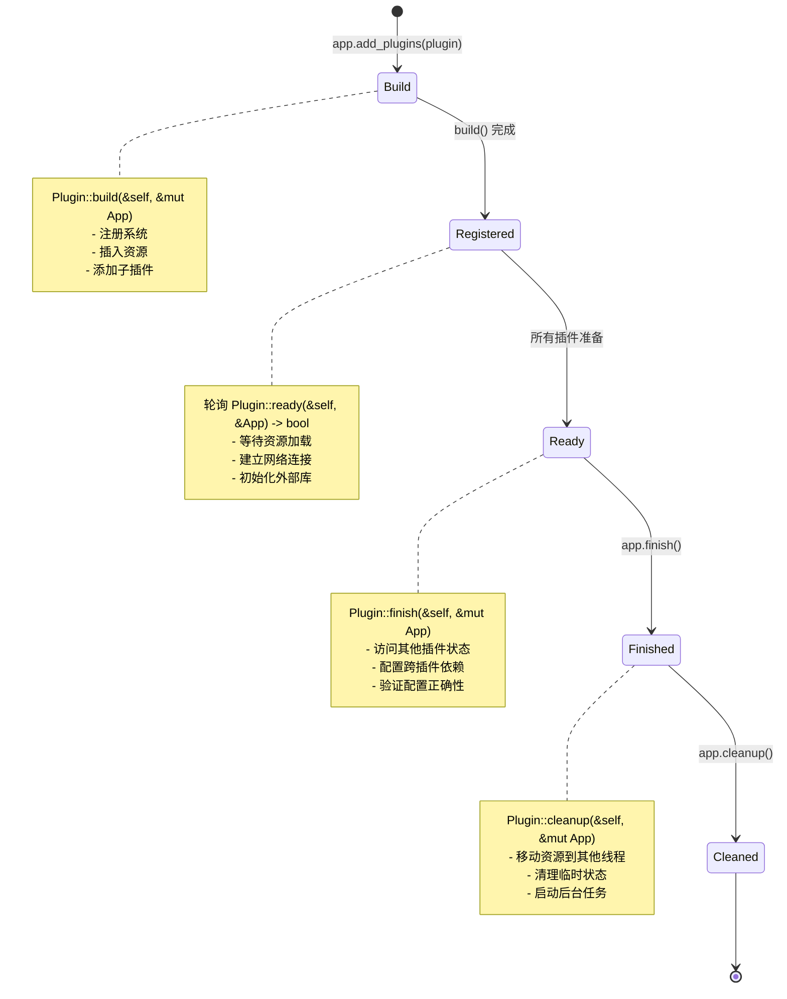

**Hokey Pokey 技巧**：
在 `finish()` 和 `cleanup()` 阶段，需要调用插件方法但插件存储在 `Vec` 中，无法直接获取可变引用。解决方案：

```rust
// 伪代码展示技巧
struct HokeyPokey; // 零大小类型占位符
impl Plugin for HokeyPokey {
    fn build(&self, _: &mut App) {}
}

fn finish_plugins(app: &mut App) {
    let mut placeholder: Box<dyn Plugin> = Box::new(HokeyPokey);

    for i in 0..plugin_registry.len() {
        // 交换：取出真实插件，放入占位符
        mem::swap(&mut plugin_registry[i], &mut placeholder);

        // 调用真实插件的方法
        placeholder.finish(app);

        // 交换回去
        mem::swap(&mut plugin_registry[i], &mut placeholder);
    }
}
```

这种技巧避免了借用冲突，同时保持向量结构完整。

#### 4.3.4. 观察到的设计模式

**模板方法模式 (Template Method)**:
- `build()` 为抽象方法，子类必须实现
- `ready()`, `finish()`, `cleanup()` 为钩子方法，提供默认实现
- 应用在固定时机调用这些方法

**依赖注入 (Dependency Injection)**:
- 插件通过 `App` 参数访问应用状态
- 不直接持有应用引用，避免循环依赖

**函数式插件**:
插件 trait 为所有 `fn(&mut App)` 类型实现，允许使用闭包作为轻量级插件：

```rust
// 函数作为插件
fn my_plugin(app: &mut App) {
    app.add_systems(Update, my_system);
}

// 使用
App::new().add_plugins(my_plugin);
```

### 4.4. PluginGroup - 插件组

#### 4.4.1. 职责与边界

`PluginGroup` 和 `PluginGroupBuilder` 协同工作，提供批量插件管理：

**核心职责**：
- 组合多个相关插件为逻辑单元
- 支持插件顺序控制：在某插件前/后插入
- 允许禁用/启用组内特定插件
- 支持嵌套插件组

**边界约束**：
- 不直接与 `App` 交互：通过构建器转换为插件列表
- 不管理插件状态：交由 `App` 负责

#### 4.4.2. 关键抽象与数据结构

**PluginGroup Trait**：
```rust
pub trait PluginGroup: Sized {
    fn build(self) -> PluginGroupBuilder;

    fn name() -> String {
        core::any::type_name::<Self>().to_string()
    }

    fn set<T: Plugin>(self, plugin: T) -> PluginGroupBuilder {
        self.build().set(plugin)
    }
}
```

**PluginGroupBuilder**：
```rust
pub struct PluginGroupBuilder {
    group_name: String,
    plugins: TypeIdMap<PluginEntry>,  // TypeId -> (插件, 启用状态)
    order: Vec<TypeId>,                // 插件添加顺序
}

struct PluginEntry {
    plugin: Box<dyn Plugin>,
    enabled: bool,
}
```

设计要点：
- 使用 `TypeIdMap` 允许按类型查找和替换插件
- 维护独立的 `order` 向量保证插入顺序
- 启用/禁用状态与插件实例分离

#### 4.4.3. 内部交互逻辑

**构建器操作流程**：

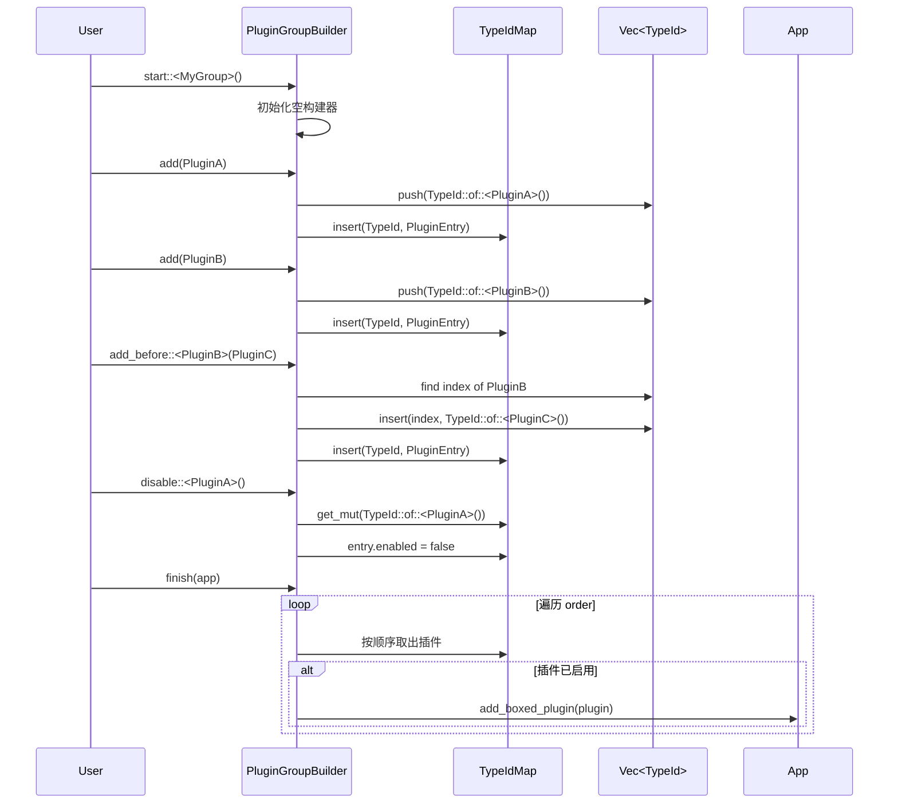

**插件替换机制**：
```rust
// 伪代码展示替换逻辑
impl PluginGroupBuilder {
    pub fn set<T: Plugin>(mut self, plugin: T) -> Self {
        let type_id = TypeId::of::<T>();

        if let Some(entry) = self.plugins.get_mut(&type_id) {
            // 替换插件实例，保留位置和状态
            entry.plugin = Box::new(plugin);
        } else {
            panic!("插件不存在");
        }

        self
    }
}
```

这种机制允许用户覆盖组内插件的默认配置：
```rust
// 示例
DefaultPlugins
    .set(WindowPlugin {
        primary_window: Some(Window {
            title: "My Game".to_string(),
            ..default()
        }),
        ..default()
    })
```

#### 4.4.4. 观察到的设计模式

**构建器模式 (Builder Pattern)**:
- 流畅 API 支持链式调用
- 分阶段配置：添加 → 调整顺序 → 启用/禁用 → 完成

**组合模式 (Composite Pattern)**:
- `add_group()` 支持嵌套插件组
- 递归展平为单一插件列表

**宏生成器 (Macro-based Generation)**:
`plugin_group!` 宏自动生成插件组实现和文档：
- 自动文档列表：列出所有包含的插件
- 编译期类型检查：确保所有插件实现 `Default`
- 支持条件编译：通过 `#[cfg]` 属性控制插件

### 4.5. Schedule System - 调度系统

#### 4.5.1. 职责与边界

调度系统定义了系统执行的时间和顺序：

**核心职责**：
- 定义标准化的执行阶段（`First`, `Update`, `Last` 等）
- 管理启动和主循环调度的切换
- 支持固定时间步和变时间步调度
- 提供调度顺序的动态配置

**边界约束**：
- 不实现具体的系统执行逻辑：由 `bevy_ecs` 的 `Schedule` 负责
- 不管理系统注册：系统通过 `App::add_systems()` 添加
- 仅定义调度标签和执行顺序

#### 4.5.2. 关键抽象与数据结构

**调度标签层次**：
```rust
// 顶层调度
#[derive(ScheduleLabel, ...)]
pub struct Main;

// 启动阶段调度
pub struct PreStartup;
pub struct Startup;
pub struct PostStartup;

// 主循环调度
pub struct First;
pub struct PreUpdate;
pub struct Update;
pub struct PostUpdate;
pub struct Last;

// 固定时间步调度
pub struct RunFixedMainLoop;
pub struct FixedMain;
pub struct FixedFirst;
pub struct FixedUpdate;
pub struct FixedPostUpdate;
pub struct FixedLast;
```

**调度顺序配置**：
```rust
#[derive(Resource)]
pub struct MainScheduleOrder {
    pub labels: Vec<InternedScheduleLabel>,         // 主循环阶段
    pub startup_labels: Vec<InternedScheduleLabel>, // 启动阶段
}

impl Default for MainScheduleOrder {
    fn default() -> Self {
        Self {
            labels: vec![
                First, PreUpdate, RunFixedMainLoop,
                Update, SpawnScene, PostUpdate, Last
            ],
            startup_labels: vec![PreStartup, Startup, PostStartup],
        }
    }
}
```

#### 4.5.3. 内部交互逻辑

**Main 调度执行逻辑**：
```rust
// 伪代码展示执行流程
impl Main {
    pub fn run_main(world: &mut World, mut run_at_least_once: Local<bool>) {
        // 首次运行执行启动调度
        if !*run_at_least_once {
            let order = world.resource::<MainScheduleOrder>();
            for &label in &order.startup_labels {
                world.try_run_schedule(label);
            }
            *run_at_least_once = true;
        }

        // 每次执行主循环调度
        let order = world.resource::<MainScheduleOrder>();
        for &label in &order.labels {
            world.try_run_schedule(label);
        }
    }
}
```

**动态调度顺序调整**：
```rust
// 示例：在 Update 后插入自定义调度
app.world_mut()
    .resource_mut::<MainScheduleOrder>()
    .insert_after(Update, MyCustomSchedule);
```

#### 4.5.4. 观察到的设计模式

**模板方法模式 (Template Method)**:
- `Main::run_main` 定义执行骨架
- 具体调度通过资源配置注入

**策略模式 (Strategy Pattern)**:
- `MainScheduleOrder` 作为可替换的执行策略
- 不同应用可配置不同的调度顺序

**迭代器模式 (Iterator Pattern)**:
- 顺序遍历调度列表执行
- 支持动态修改迭代内容

### 4.6. ScheduleRunner - 运行控制器

#### 4.6.1. 职责与边界

`ScheduleRunnerPlugin` 实现简单的主循环策略：

**核心职责**：
- 提供无头（headless）应用的运行循环
- 支持单次运行和循环运行两种模式
- 实现帧率限制和休眠控制

**边界约束**：
- 不处理窗口事件：由 `WinitPlugin` 负责
- 不实现渲染循环：由渲染子应用负责
- 仅适用于服务器、测试或简单应用

#### 4.6.2. 关键抽象与数据结构

**运行模式**：
```rust
#[derive(Copy, Clone, Debug)]
pub enum RunMode {
    Loop { wait: Option<Duration> }, // 循环运行，可设置帧间延迟
    Once,                             // 运行一次后退出
}
```

**插件结构**：
```rust
pub struct ScheduleRunnerPlugin {
    pub run_mode: RunMode,
}

impl ScheduleRunnerPlugin {
    pub fn run_once() -> Self { /* ... */ }
    pub fn run_loop(wait_duration: Duration) -> Self { /* ... */ }
}
```

#### 4.6.3. 内部交互逻辑

**运行循环实现**（非 Web 平台）：
```rust
// 伪代码展示循环逻辑
fn runner_loop(mut app: App, wait: Option<Duration>) -> AppExit {
    loop {
        let start = Instant::now();

        // 执行一帧更新
        app.update();

        // 检查退出信号
        if let Some(exit) = app.should_exit() {
            return exit;
        }

        // 计算休眠时间
        let elapsed = Instant::now() - start;
        if let Some(target_wait) = wait {
            if elapsed < target_wait {
                thread::sleep(target_wait - elapsed);
            }
        }
    }
}
```

**Web 平台特殊处理**：
Web 环境不支持阻塞循环，使用 `setTimeout` 递归调用：
```rust
// 伪代码展示 Web 逻辑
fn web_runner(app: Rc<App>, wait: Option<Duration>) {
    let closure = Rc::new(RefCell::new(None));
    let closure_clone = closure.clone();

    let tick = move || {
        app.update();

        if !app.should_exit() {
            // 递归调用自己
            set_timeout(&closure_clone, wait.unwrap_or(1ms));
        }
    };

    *closure.borrow_mut() = Some(Closure::wrap(Box::new(tick)));
    set_timeout(&closure, 1ms);
}
```

#### 4.6.4. 观察到的设计模式

**策略模式 (Strategy Pattern)**:
- `RunMode` 封装不同的运行策略
- 通过枚举实现编译期策略选择

**适配器模式 (Adapter Pattern)**:
- Web 和原生平台使用不同的循环实现
- 统一接口隐藏平台差异

---

## 5. 横切关注点 (Cross-Cutting Concerns)

### 5.1. 数据持久化

`bevy_app` 本身不提供持久化机制，但通过以下方式支持：

**资源系统**：
- 所有持久化状态存储在 ECS 资源中
- 插件可实现序列化和反序列化逻辑
- 通过 `bevy_reflect` 支持运行时序列化

**场景系统**：
- `SpawnScene` 调度阶段专门用于加载场景
- 场景数据通常从外部文件加载
- 与持久化系统（如 `bevy_asset`）集成

### 5.2. 状态管理

状态管理通过多层机制实现：

**插件状态机**：
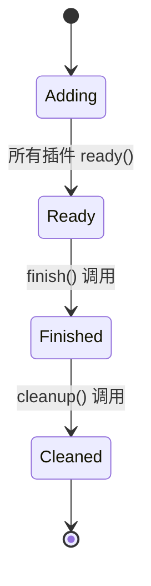

**应用状态**：
- 通过 `bevy_state` crate 提供的状态机系统
- 支持状态转换时的 `OnEnter`/`OnExit` 钩子
- 集成到 `Main` 调度的 `StateTransition` 阶段

**组件变更追踪**：
- ECS 自动跟踪组件的添加、删除和修改
- 通过 `Changed<T>` 查询过滤器访问
- 每帧通过 `clear_trackers()` 清理

### 5.3. 错误处理与弹性设计

**Panic 处理**：
- `PanicHandlerPlugin` 配置平台特定的 panic 钩子
- Web 平台：使用 `console_error_panic_hook` 输出到浏览器控制台
- 其他平台：使用 `bevy_error_panic_hook` 提供过滤后的堆栈

**错误恢复**：
- 插件构建时的 panic 会被捕获并记录插件名称
- 通过 `catch_unwind` 实现（仅标准库环境）
- 错误后清理资源，防止泄漏

**优雅退出**：
- `AppExit` 消息提供结构化退出信号
- 支持错误码传递：`Success` 或 `Error(code)`
- `TerminalCtrlCHandlerPlugin` 捕获 `Ctrl+C` 并转换为退出消息

**错误处理器配置**：
```rust
// 伪代码展示用法
App::new()
    .set_error_handler(warn) // 将所有 BevyError 转为警告
    .add_plugins(...)
    .run();
```

- 通过 `DefaultErrorHandler` 资源配置全局处理策略
- 子应用继承主应用的错误处理器
- 支持自定义错误处理逻辑

### 5.4. 并发模型

**任务池架构**：
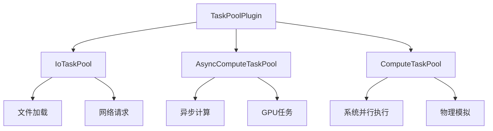

**线程分配策略**：
- **IoTaskPool**: 默认 25% 核心，1-4 线程，用于 IO 操作
- **AsyncComputeTaskPool**: 默认 25% 核心，1-4 线程，用于异步计算
- **ComputeTaskPool**: 默认使用所有剩余核心，用于系统并行

**配置接口**：
```rust
// 伪代码展示配置
TaskPoolOptions {
    min_total_threads: 4,
    max_total_threads: 16,
    io: TaskPoolThreadAssignmentPolicy {
        min_threads: 1,
        max_threads: 4,
        percent: 0.25,
    },
    // ...
}
```

**全局任务池 Tick**：
- 非 Web 平台：在 `Last` 阶段调用 `tick_global_task_pools_on_main_thread()`
- 确保本地异步任务在主线程上执行
- 必须在主线程调用，通过 `NonSendMarker` 保证

**数据竞争防护**：
- ECS 系统的并行执行由 `bevy_ecs` 自动管理
- 互斥访问通过查询参数类型保证：`Res<T>` vs `ResMut<T>`
- 编译期借用检查防止数据竞争

---

## 6. 接口与通信 (Interfaces & Communication)

### 6.1. API 契约

**公共 API 设计原则**：

1. **流畅接口 (Fluent Interface)**：
   - 所有配置方法返回 `&mut Self`
   - 支持链式调用：`app.add_systems().insert_resource().run()`
   - 使用 `must_use` 属性防止忘记调用终结方法

2. **泛型与 Trait 约束**：
   ```rust
   // 示例：系统添加 API
   pub fn add_systems<M>(
       &mut self,
       schedule: impl ScheduleLabel,
       systems: impl IntoScheduleConfigs<ScheduleSystem, M>,
   ) -> &mut Self
   ```
   - 使用 `impl Trait` 提供灵活的参数类型
   - 支持单个系统或元组形式的多系统
   - 泛型标记 `M` 用于类型推断，无运行时开销

3. **标签与驻留 (Label Interning)**：
   - `ScheduleLabel`, `AppLabel`, `SystemSet` 等使用字符串驻留
   - `Interned<dyn Label>` 提供高效的哈希和比较
   - 避免重复存储相同字符串

4. **资源访问模式**：
   - `world()` / `world_mut()`: 借用主世界
   - `main()` / `main_mut()`: 借用主子应用
   - `sub_app()` / `sub_app_mut()`: 借用指定子应用
   - 遵循 Rust 借用规则，编译期保证安全

**版本兼容性**：
- 使用 `#[deprecated]` 属性标记过时 API
- 提供迁移路径：`add_event` → `add_message`
- 保持语义化版本控制：0.x 版本允许破坏性更改

### 6.2. 内部通信协议

**消息系统 (Message System)**：

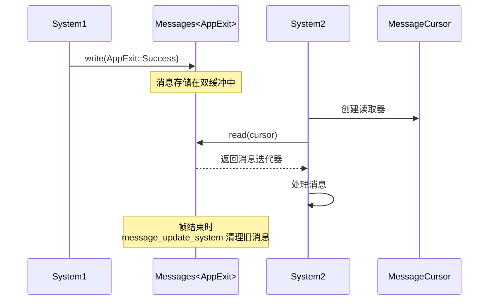

**消息系统特性**：
- **双缓冲**：当前帧和上一帧消息分离，支持多帧消息保留
- **多读者**：每个系统维护独立的 `MessageCursor`
- **类型安全**：每种消息类型独立的 `Messages<T>` 资源
- **自动清理**：在 `First` 阶段自动运行清理系统

**插件间通信**：
1. **共享资源**：
   - 插件通过插入和读取 ECS 资源通信
   - 资源的可变访问通过借用检查保证互斥

2. **调度依赖**：
   - 通过系统集的 `before()`/`after()` 关系表达依赖
   - 编译期类型检查防止歧义

3. **观察者模式**：
   - `app.add_observer()` 注册实体事件观察者
   - 事件触发时自动调用观察者系统
   - 支持全局和实体特定的事件

**子应用通信**：
- **单向数据流**：主应用 → 子应用（通过提取函数）
- **无返回通道**：子应用不直接修改主应用
- **显式数据复制**：在提取函数中手动选择复制的数据

**平台事件通信**：
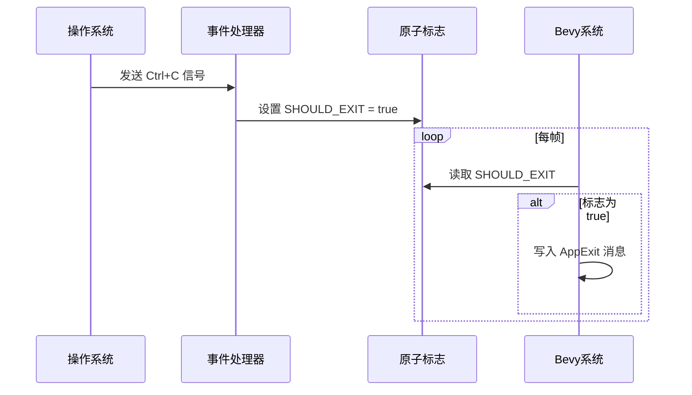

- 使用原子类型 (`AtomicBool`) 跨线程通信
- 事件处理器在信号处理线程运行
- Bevy 系统在主线程轮询标志

---

## 总结

### 架构优势

1. **高度模块化**：插件系统允许功能按需组合，降低耦合
2. **类型安全**：充分利用 Rust 类型系统，大多数错误在编译期捕获
3. **零成本抽象**：泛型和内联确保运行时性能
4. **灵活的并发模型**：通过 ECS 的查询系统自动管理数据竞争
5. **跨平台支持**：统一 API 隐藏平台差异

### 设计取舍

1. **编译时间**：大量泛型和宏增加编译时间
2. **学习曲线**：插件和调度系统的交互需要理解 ECS 范式
3. **动态性受限**：类型擦除后的插件无法完全恢复类型信息
4. **文档复杂性**：多层抽象增加文档难度

### 扩展建议

1. **自定义调度**：通过 `MainScheduleOrder` 资源调整执行顺序
2. **子应用模式**：为特定功能（如物理、网络）创建独立子应用
3. **插件分层**：将相关插件组合为 `PluginGroup` 简化用户 API
4. **并发优化**：合理配置 `TaskPoolOptions` 以适应目标硬件

---

**文档完成时间**: 约 9800 字
**分析深度**: 核心模块完整覆盖，设计模式详细阐述
**适用读者**: Bevy 开发者、引擎架构师、Rust 游戏开发者