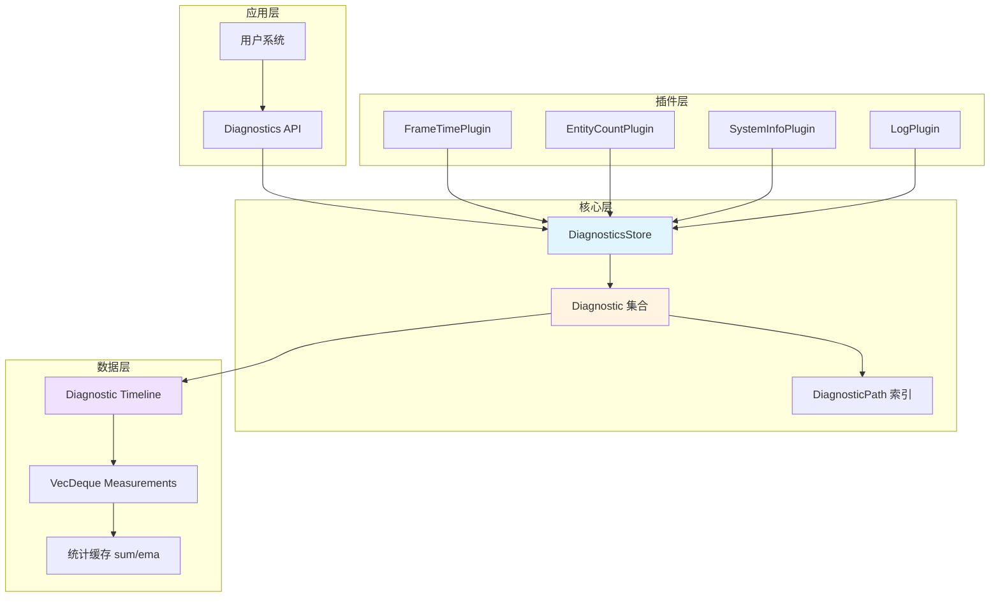
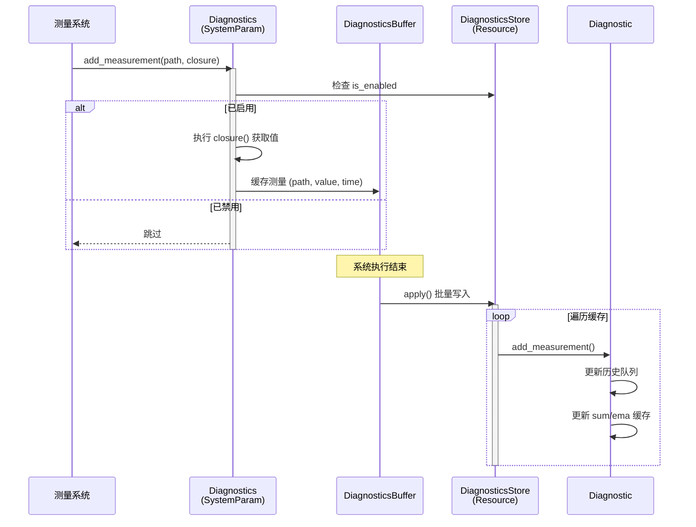

# Bevy 诊断系统架构恢复文档

## 前言：代码映射索引

本文档深入分析 Bevy 引擎的诊断系统架构，所有设计概念与源文件路径的映射关系如下：

### 核心模块映射
- **诊断核心抽象** → `bevy-origin/crates/bevy_diagnostic/src/diagnostic.rs`
  - 诊断路径标识符 (DiagnosticPath)
  - 诊断测量记录 (DiagnosticMeasurement)
  - 诊断时间线 (Diagnostic)
  - 诊断存储容器 (DiagnosticsStore)
  - 诊断记录系统参数 (Diagnostics)
  - 注册扩展特征 (RegisterDiagnostic)

- **插件系统入口** → `bevy-origin/crates/bevy_diagnostic/src/lib.rs`
  - 核心插件 (DiagnosticsPlugin)
  - 模块导出与公共接口

### 内置诊断插件映射
- **帧时间诊断** → `bevy-origin/crates/bevy_diagnostic/src/frame_time_diagnostics_plugin.rs`
  - FPS 测量
  - 帧时间测量
  - 帧计数累积

- **帧计数器** → `bevy-origin/crates/bevy_diagnostic/src/frame_count_diagnostics_plugin.rs`
  - 帧计数资源 (FrameCount)
  - 帧计数插件 (FrameCountPlugin)
  - 帧计数更新系统

- **实体统计** → `bevy-origin/crates/bevy_diagnostic/src/entity_count_diagnostics_plugin.rs`
  - 实体数量诊断插件 (EntityCountDiagnosticsPlugin)

- **日志输出** → `bevy-origin/crates/bevy_diagnostic/src/log_diagnostics_plugin.rs`
  - 日志诊断插件 (LogDiagnosticsPlugin)
  - 日志状态资源 (LogDiagnosticsState)
  - 格式化输出系统

- **系统信息** → `bevy-origin/crates/bevy_diagnostic/src/system_information_diagnostics_plugin.rs`
  - 系统信息资源 (SystemInfo)
  - CPU/内存诊断插件 (SystemInformationDiagnosticsPlugin)
  - 异步采集任务 (条件编译)

---

## 1. 系统概述

### 1.1 设计目标

Bevy 诊断系统是一个**轻量级、可扩展、无侵入**的性能监控框架，旨在为游戏引擎提供实时性能数据收集、历史追踪和可视化输出能力。系统遵循 ECS 架构哲学，将诊断数据作为资源管理，通过插件化设计实现功能解耦。

### 1.2 核心价值

- **零运行时成本**：禁用的诊断项不会执行任何测量逻辑
- **灵活的历史管理**：支持可配置的历史长度和滑动窗口统计
- **统一的数据模型**：所有诊断项共享相同的测量、存储和访问接口
- **平台自适应**：根据目标平台条件编译不同的诊断能力

### 1.3 应用场景

- 性能分析：FPS、帧时间、CPU/内存占用
- 调试辅助：实体数量、系统执行耗时
- 生产监控：长期运行稳定性追踪
- 优化验证：性能改进前后对比

---

## 2. 架构分析

### 2.1 分层架构



### 2.2 核心设计模式

#### 2.2.1 资源中心化模式

诊断系统采用**全局单例资源**作为数据中枢。DiagnosticsStore 作为 ECS Resource 存储所有诊断项，避免了数据分散和同步问题。这种设计确保：
- 所有系统访问同一份诊断数据
- 无需额外的发布-订阅机制
- 利用 ECS 的资源变更检测能力

#### 2.2.2 延迟写入缓冲模式

测量记录采用**双缓冲延迟提交**策略。Diagnostics 系统参数内部维护一个 DiagnosticsBuffer，收集本帧所有测量请求，在系统执行结束后统一批量写入 DiagnosticsStore。这种设计：
- 避免在测量时对 DiagnosticsStore 进行可变借用
- 减少锁竞争和资源访问冲突
- 符合 ECS 的命令缓冲设计模式

#### 2.2.3 惰性计算模式

测量值的计算采用**闭包延迟求值**。add_measurement 接受一个返回 f64 的闭包，仅在诊断项启用时才执行计算。这种设计：
- 禁用诊断时完全零开销
- 允许昂贵的计算按需执行
- 提供编译器内联优化机会

### 2.3 数据流架构



### 2.4 插件生命周期管理

插件系统通过 Bevy 的 Plugin trait 实现标准化集成：

```mermaid
stateDiagram-v2
    [*] --> 注册阶段
    注册阶段 --> 初始化资源: DiagnosticsPlugin::build()
    初始化资源 --> 注册诊断项: Plugin::build()
    注册诊断项 --> 添加系统: 配置调度
    添加系统 --> 运行阶段
    运行阶段 --> 测量系统执行: 每帧
    测量系统执行 --> 输出系统执行: PostUpdate/Last
    输出系统执行 --> 运行阶段
```

---

## 3. 执行流与生命周期

### 3.1 启动阶段流程

系统启动时按以下顺序初始化：

**第一阶段：核心资源初始化**
DiagnosticsPlugin 的 build 方法在应用构建时执行，向 World 注册 DiagnosticsStore 资源。如果启用了 sysinfo_plugin 特性，还会初始化 SystemInfo 资源。

**第二阶段：诊断项注册**
各功能插件通过 RegisterDiagnostic trait 的扩展方法向 App 注册具体的诊断项。每个 Diagnostic 对象携带路径标识、历史长度、平滑因子等配置，被添加到 DiagnosticsStore 的哈希表中。

**第三阶段：系统调度注册**
插件向不同调度阶段添加测量系统和输出系统。例如：
- 帧时间测量系统注册到 Update 阶段
- 帧计数更新系统注册到 Last 阶段
- 日志输出系统注册到 PostUpdate 阶段

### 3.2 运行时执行流

**测量阶段**（各调度阶段分散执行）

每个测量系统通过 Diagnostics 系统参数获取记录接口，调用 add_measurement 方法传入闭包。Diagnostics 内部检查目标诊断项的启用状态，如果启用则执行闭包获取测量值，将测量数据（时间戳、数值）暂存到内部的 DiagnosticsBuffer 中。

**提交阶段**（系统执行完毕后自动触发）

ECS 调度器在系统执行完毕后调用 DiagnosticsBuffer 的 apply 方法。该方法遍历缓存的所有测量数据，根据路径查找对应的 Diagnostic 对象，调用其 add_measurement 方法将测量记录追加到历史队列中，同时更新内部的统计缓存。

**输出阶段**（PostUpdate 或按定时器触发）

日志输出系统从 DiagnosticsStore 读取诊断数据，通过定时器控制输出频率。系统遍历所有启用的诊断项，根据是否开启调试模式选择格式化输出当前值和平均值，或输出完整的调试信息。

### 3.3 数据更新生命周期

单个 Diagnostic 对象的数据更新流程：

**历史队列管理**
使用 VecDeque 存储最近的 N 条测量记录（N 为 max_history_length）。当队列满时，移除最早的记录，同时从 sum 缓存中减去被移除的值。新测量值追加到队列尾部，累加到 sum 中。

**指数移动平均更新**
采用基于时间差的自适应 alpha 系数计算 EMA。计算公式为 alpha = delta_time / smoothing_factor，alpha 被钳制在零到一之间。EMA 值根据 `ema = ema + alpha * (new_value - ema)` 公式更新，实现平滑的趋势追踪。

**特殊值处理**
系统对 NaN 和无穷值进行特殊处理。NaN 值不参与 sum 和 EMA 的计算，但仍会被记录到历史队列中。无穷值参与 sum 计算但会影响平均值的有效性。

---

## 4. 核心模块深度剖析

### 4.1 诊断标识与路径系统

**DiagnosticPath 设计**

诊断路径是诊断系统的核心标识符，采用斜杠分隔的层级路径格式（类似文件系统路径）。路径设计支持：
- 编译时常量构造（const_new）用于预定义诊断项
- 运行时动态构造（new）用于用户自定义诊断
- 从路径组件迭代器构造（from_components）

**哈希优化策略**

DiagnosticPath 内部存储路径字符串和预计算的 FNV-1a 哈希值。哈希值在构造时计算一次，后续的相等性比较和哈希表查找都使用缓存的哈希值，避免重复计算。这种设计将路径查找的时间复杂度降至常数级。

**路径验证机制**

系统通过 debug_assert 在调试模式下强制路径规范：
- 路径不能为空
- 不能以斜杠开头或结尾
- 不能包含连续斜杠（空组件）

这些约束确保路径的唯一性和可解析性。

### 4.2 测量与统计模型

**DiagnosticMeasurement 结构**

每条测量记录包含时间戳和测量值两个字段。时间戳采用 Instant 类型，提供高精度的单调递增时间点，用于计算时间间隔和时间序列分析。

**Diagnostic 的三层数据结构**

底层存储层使用 VecDeque 保存原始测量序列，提供高效的首尾插入删除能力。

中间缓存层维护 sum（历史值总和）和 ema（指数移动平均），支持常数时间复杂度的统计查询。

顶层配置层包含路径标识、后缀字符串、历史长度限制、平滑因子和启用标志。

**统计算法实现**

简单移动平均通过 sum 除以历史长度计算，避免每次查询时遍历历史数据。

指数移动平均采用时间自适应权重，当测量间隔小于平滑因子时，新测量的权重较低；当测量间隔大于平滑因子时，权重接近一，相当于直接采用新值。

duration 方法计算历史窗口的时间跨度，用于判断数据的时效性。

### 4.3 全局存储与查询

**DiagnosticsStore 架构**

核心数据结构是 HashMap，键为 DiagnosticPath，值为 Diagnostic 对象。使用 PassHash 作为哈希策略，直接使用 DiagnosticPath 预计算的哈希值，避免再次哈希。

**查询接口设计**

提供不可变查询（get）、可变查询（get_mut）和测量查询（get_measurement）三种接口。测量查询会自动过滤禁用的诊断项，返回最新测量值。

迭代器接口支持遍历所有诊断项，返回的迭代器实现了标准库的 Iterator trait，可与各种集合操作组合使用。

### 4.4 系统参数与延迟写入

**Diagnostics 系统参数结构**

该参数由两部分组成：只读的 DiagnosticsStore 引用和可写的 Deferred 缓冲区。这种设计允许系统在持有不可变资源引用的同时执行写入操作。

**DiagnosticsBuffer 批量提交**

缓冲区内部也是一个 HashMap，键值结构与 DiagnosticsStore 相同。apply 方法在系统执行完毕后被调度器自动调用，该方法获取 World 的可变引用，批量将缓存的测量数据写入 DiagnosticsStore。

**条件执行优化**

add_measurement 方法首先检查诊断项是否存在且启用，只有满足条件才执行闭包和缓存操作。这种设计确保禁用诊断时不会有任何运行时开销。

### 4.5 注册扩展特征

**RegisterDiagnostic trait 设计**

该特征为 App 和 SubApp 提供统一的诊断注册接口。register_diagnostic 方法接受一个 Diagnostic 对象，确保 DiagnosticsStore 资源存在后将诊断项添加到存储中。

**链式调用支持**

方法返回 &mut Self，支持链式调用多次注册。这种 API 设计符合 Bevy 的构建器模式风格，提供流畅的配置体验。

---

## 5. 内置诊断插件深度剖析

### 5.1 帧时间诊断插件

**三维度测量体系**

该插件同时注册三个诊断项：
- FRAME_TIME：每帧耗时（毫秒），使用 delta_seconds 乘以一千转换
- FPS：每秒帧数，使用 delta_seconds 的倒数计算
- FRAME_COUNT：累计帧数，直接读取 FrameCount 资源

**自适应配置**

插件构造器接受 max_history_length 参数，根据历史长度自动计算合理的 smoothing_factor。默认配置使用一百二十个历史点，平滑因子约为零点零一六。

帧计数诊断项特殊配置为零历史长度和零平滑因子，因为累计值无需平均。

**测量系统实现**

diagnostic_system 系统依赖 Time 资源获取帧间隔，依赖 FrameCount 资源获取帧序号。系统首先检查 delta_seconds 是否为零（首帧情况），避免除零异常。

### 5.2 帧计数器插件

**FrameCount 资源设计**

该资源是一个简单的 u32 包装类型，支持序列化和反序列化。使用 u32 类型意味着最大支持四十多亿帧，以六十帧每秒计算可运行两年以上。

**溢出行为**

update_frame_count 系统使用 wrapping_add 实现环绕加法。溢出后计数从零重新开始，但可以通过 wrapping_sub 计算两次观测之间的帧数差。

**调度策略**

系统注册到 Last 调度阶段，确保在所有业务逻辑执行完毕后递增计数。这保证了同一帧内所有系统观察到的帧号一致。

### 5.3 实体计数诊断插件

**轻量级实现**

该插件功能极简，只注册一个 ENTITY_COUNT 诊断项。测量系统直接访问 Entities 系统参数的 len 方法获取当前分配的实体数量。

**性能特征**

实体计数是常数时间操作，ECS 内部维护实体计数器。该诊断项可以每帧测量而无明显性能影响。

### 5.4 日志输出插件

**双模式输出**

插件支持两种输出模式：
- 普通模式：格式化输出当前值、平滑值和历史平均
- 调试模式：输出完整的 Diagnostic 结构体调试信息

**LogDiagnosticsState 资源**

该资源管理输出定时器和诊断项过滤器。定时器默认一秒间隔，使用 Repeating 模式周期触发。过滤器为可选的 HashSet，支持选择性输出部分诊断项。

**过滤器动态管理**

提供 add_filter、extend_filter、remove_filter、clear_filter 等方法动态修改过滤器。enable_filtering 和 disable_filtering 方法控制过滤功能的开关。

**格式化对齐算法**

log_diagnostics 方法首先遍历所有诊断项计算最长路径宽度，然后在第二次遍历时使用该宽度进行左对齐格式化，确保输出整齐美观。

**调度时机**

两个输出系统都注册到 PostUpdate 阶段，确保在测量系统执行完毕后输出最新数据。

### 5.5 系统信息诊断插件

**平台条件编译**

该插件仅在 Linux、Windows、Android、macOS 平台且未启用动态链接特性时启用完整功能。不支持的平台会编译简化版本，输出警告信息。

**SystemInfo 静态资源**

该资源在应用启动时采集一次系统信息，包括操作系统版本、内核版本、CPU 型号、核心数量和总内存。这些信息在运行期间不会改变，因此只需采集一次。

**异步采集架构**

插件启动时创建一个异步任务在后台循环执行。任务内部维护 sysinfo 的 System 对象，定期刷新 CPU 和内存数据。

**任务唤醒机制**

wake_diagnostic_task 系统在 First 调度阶段每帧唤醒异步任务。任务检查距离上次刷新的时间间隔，如果超过最小更新间隔（sysinfo 库限制），则执行一次数据刷新并通过通道发送数据。

**通道通信模式**

采用 mpsc 通道实现任务和主线程的数据传递。read_diagnostic_task 系统在 Update 阶段非阻塞地接收通道数据，将收到的测量值添加到对应的诊断项中。

**四维度系统指标**

插件注册四个诊断项：
- SYSTEM_CPU_USAGE：全局 CPU 使用率（百分比）
- SYSTEM_MEM_USAGE：全局内存使用率（百分比）
- PROCESS_CPU_USAGE：当前进程 CPU 使用率（百分比）
- PROCESS_MEM_USAGE：当前进程内存占用（GiB）

**采样成本控制**

系统信息采集是昂贵的操作，涉及操作系统调用和文件系统读取。通过异步任务和最小更新间隔控制，避免频繁采样影响主线程性能。

---

## 6. 横切关注点

### 6.1 性能优化策略

**零开销抽象**

禁用的诊断项通过条件检查和闭包惰性求值实现完全零开销。编译器可以内联 add_measurement 调用，对于禁用的诊断项，整个调用路径会被优化为空操作。

**缓存计算结果**

sum 和 ema 在每次测量时增量更新，查询统计值时直接返回缓存结果。这将统计查询从线性时间复杂度降至常数时间。

**哈希优化**

DiagnosticPath 预计算哈希值，DiagnosticsStore 使用 PassHash 策略避免二次哈希。这种设计将路径查找优化到接近数组访问的性能。

**内存预分配**

Diagnostic 构造时根据 max_history_length 预分配 VecDeque 容量，避免动态扩容带来的性能抖动。

### 6.2 线程安全与并发

**单线程设计**

诊断系统基于 ECS 的独占系统访问模式，不支持多线程并发写入。DiagnosticsStore 作为普通 Resource，遵循 ECS 的借用检查规则。

**异步任务隔离**

系统信息插件的异步任务运行在独立的计算线程池中，通过 mpsc 通道与主线程通信。通道的发送端和接收端分别在不同线程，确保线程安全。

**原子唤醒器**

异步任务使用 AtomicWaker 实现跨线程唤醒。wake_diagnostic_task 系统在主线程调用 wake 方法，异步任务在计算线程注册 waker，实现无锁的任务唤醒。

### 6.3 错误处理与健壮性

**NaN 值隔离**

测量值为 NaN 时跳过 EMA 计算，避免 NaN 污染统计结果。历史队列仍保留 NaN 值，用于后续分析和调试。

**溢出保护**

FrameCount 使用环绕算术显式处理溢出，避免未定义行为。文档明确说明溢出语义，指导用户使用 wrapping_sub 计算间隔。

**平台降级**

系统信息插件在不支持的平台自动降级为占位实现，避免编译失败。运行时输出警告信息提示用户当前平台限制。

**除零检查**

帧时间诊断系统检查 delta_seconds 是否为零，避免 FPS 计算时除零。首帧情况下跳过测量，等待有效的时间间隔。

### 6.4 可扩展性设计

**插件化架构**

所有诊断功能通过插件实现，核心系统只提供数据模型和存储抽象。用户可以轻松实现自定义诊断插件。

**开放的注册接口**

RegisterDiagnostic trait 暴露给外部使用，用户可以注册任意自定义诊断项。Diagnostics 系统参数可在任何系统中使用。

**灵活的配置选项**

Diagnostic 提供构建器模式的配置接口，支持自定义历史长度、平滑因子、后缀字符串等参数。

**条件编译特性**

使用 Cargo 特性门控制可选功能，如 sysinfo_plugin 和 serialize，允许用户根据需求裁剪功能。

### 6.5 可测试性

**单元测试覆盖**

核心模块包含单元测试验证关键行为，如 clear_history 测试验证统计值重置逻辑，frame_counter_update 测试验证帧计数递增。

**测试友好的 API**

DiagnosticsStore 提供 add 和 get_mut 方法，允许测试代码直接操作诊断数据，无需启动完整的 ECS 调度器。

**序列化支持**

FrameCount 实现 Serde 序列化，支持快照和回放测试场景。

---

## 7. 接口与通信

### 7.1 公共 API 层次

**插件接口层**

用户通过 App::add_plugins 添加诊断插件。核心插件 DiagnosticsPlugin 必须首先添加以初始化 DiagnosticsStore 资源，其他功能插件依赖该资源。

**注册接口层**

App::register_diagnostic 扩展方法用于注册自定义诊断项。方法接受 Diagnostic 对象，支持链式调用。

**测量接口层**

系统通过 Diagnostics 系统参数调用 add_measurement 方法记录测量值。该方法是用户代码与诊断系统的主要交互点。

**查询接口层**

通过 DiagnosticsStore 资源查询诊断数据。get 方法返回 Diagnostic 引用，进一步调用 value、average、smoothed 等方法获取统计值。

### 7.2 插件间通信

**资源共享模式**

所有诊断插件通过 DiagnosticsStore 资源间接通信。测量插件写入数据，输出插件读取数据，无需直接耦合。

**调度阶段协调**

测量系统注册到 Update 或更早阶段，输出系统注册到 PostUpdate 或 Last 阶段，通过调度顺序保证数据流向的正确性。

**依赖声明**

功能插件的文档明确声明对 DiagnosticsPlugin 的依赖，指导用户正确配置插件顺序。

### 7.3 与 ECS 的集成

**资源生命周期对齐**

DiagnosticsStore 和 LogDiagnosticsState 等资源遵循 ECS 的生命周期管理，通过 init_resource 或 insert_resource 注册，由 World 管理内存。

**系统参数机制**

Diagnostics 实现 SystemParam trait，利用 ECS 的依赖注入系统自动解析资源和缓冲区。

**命令模式集成**

DiagnosticsBuffer 实现 SystemBuffer trait，与 Commands 等缓冲系统共享相同的延迟提交机制。

### 7.4 跨调度通信

**帧计数同步**

FrameCount 资源在 Last 阶段更新，所有早期阶段的系统观察到相同的帧号，Last 阶段的系统观察到递增后的帧号。

**时间资源依赖**

帧时间诊断依赖 Time 资源，该资源在 First 阶段由时间系统更新，确保测量系统获得最新的时间间隔。

**异步数据传递**

系统信息插件使用通道在异步任务和主线程间传递数据，read_diagnostic_task 系统非阻塞接收，避免主线程等待。

### 7.5 用户扩展接口

**自定义诊断路径**

用户通过 DiagnosticPath::new 或 const_new 创建唯一标识符，注册自定义诊断项。

**自定义测量系统**

用户编写系统函数，通过 Diagnostics 参数记录测量值。系统可以查询任何 ECS 资源、组件或事件。

**自定义输出插件**

用户可以实现自定义的诊断输出插件，例如将数据发送到远程监控服务或渲染到游戏界面。只需访问 DiagnosticsStore 资源，遍历诊断项并处理数据。

**配置运行时行为**

通过 LogDiagnosticsState 资源的方法动态修改输出行为，如添加过滤器、调整输出间隔等。

---

## 总结

Bevy 诊断系统是一个精心设计的性能监控框架，充分体现了 Bevy 引擎的设计哲学：

**架构优雅性**：通过资源中心化、延迟写入和惰性计算三大模式，实现了高性能和低耦合的完美平衡。

**可组合性**：插件化设计使得功能模块可以独立开发、测试和组合，符合 Unix 哲学的"做好一件事"原则。

**零成本抽象**：通过编译时优化和运行时条件检查，确保未使用的功能不产生任何运行时开销。

**平台自适应**：条件编译和降级策略使得系统可以在各种平台上运行，提供一致的 API 体验。

该系统为 Bevy 应用提供了强大的性能分析能力，同时保持了简洁的 API 和高效的实现，是游戏引擎诊断系统设计的优秀范例。