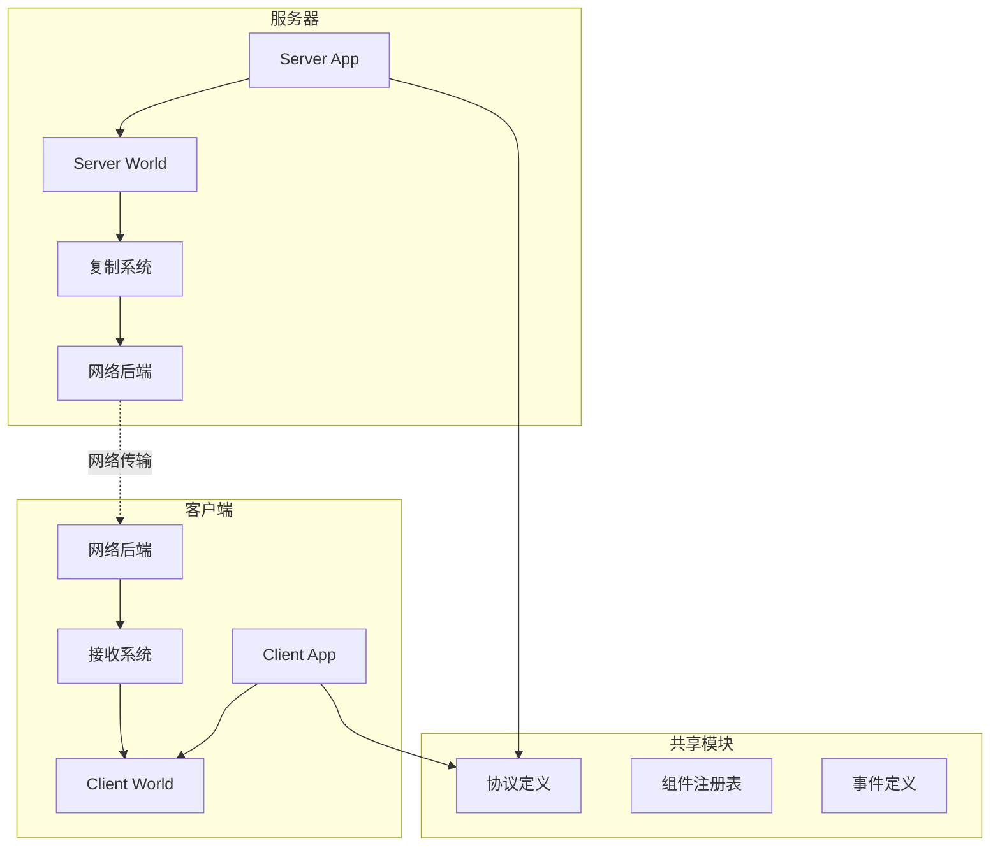
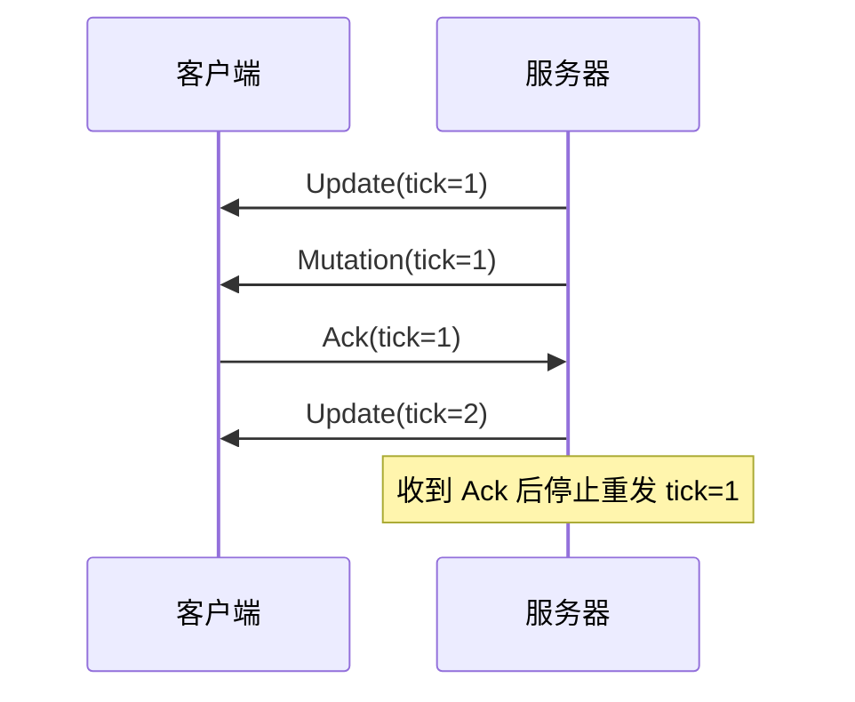
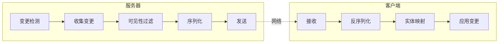
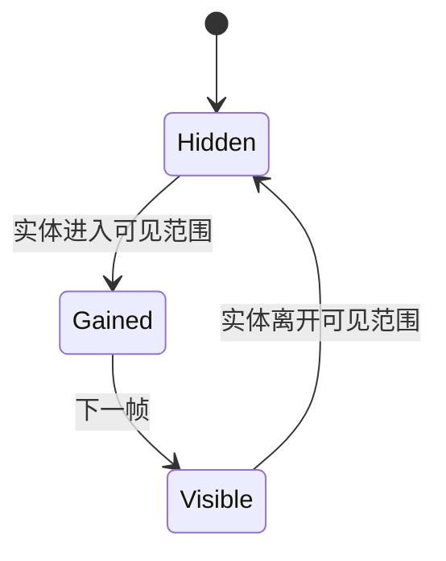

# Bevy Replicon 技术设计文档

## 目录

1. [执行摘要](#执行摘要)
2. [系统架构概览](#系统架构概览)
3. [核心概念](#核心概念)
4. [模块设计](#模块设计)
5. [网络协议设计](#网络协议设计)
6. [数据流程](#数据流程)
7. [复制机制详解](#复制机制详解)
8. [事件系统](#事件系统)
9. [可见性控制](#可见性控制)
10. [性能优化策略](#性能优化策略)
11. [扩展机制](#扩展机制)
12. [API设计](#api设计)

---

## 执行摘要

Bevy Replicon 是一个为 Bevy 游戏引擎设计的服务器权威网络复制框架。它提供了一个高性能、灵活且易用的网络同步解决方案，专门针对多人游戏开发。

### 核心特性

- **服务器权威架构**：所有游戏状态由服务器控制，防止作弊
- **自动复制系统**：基于 ECS 变更检测自动同步实体和组件
- **双向事件系统**：支持客户端到服务器和服务器到客户端的事件传输
- **灵活的可见性控制**：细粒度控制每个客户端可见的世界部分
- **带宽优化**：多种优化策略减少网络流量
- **模块化设计**：清晰的模块边界，易于扩展和自定义

---

## 系统架构概览

### 架构图



### 模块层次结构

```
bevy_replicon/
├── server/              # 服务器端逻辑
│   ├── replication/     # 复制消息生成
│   ├── visibility/      # 可见性管理
│   └── events/          # 服务器事件处理
├── client/              # 客户端逻辑
│   ├── replication/     # 复制消息接收
│   ├── confirmation/    # 确认机制
│   └── events/          # 客户端事件处理
├── shared/              # 共享功能
│   ├── backend/         # 网络后端抽象
│   ├── protocol/        # 协议定义
│   ├── replication/     # 复制规则
│   └── events/          # 事件系统
└── utils/               # 工具函数
```

---

## 核心概念

### 1. 服务器权威模型

系统采用严格的服务器权威模型：
- **单向复制**：状态只能从服务器复制到客户端
- **输入验证**：客户端输入通过事件发送，服务器验证后执行
- **防作弊设计**：客户端无法直接修改游戏状态

### 2. Tick 系统

```rust
// 服务器 Tick 管理
pub struct ServerTick {
    current: RepliconTick,
}

// 客户端 Tick 跟踪
pub struct ClientTicks {
    update_tick: Option<RepliconTick>,
    mutate_tick: Option<RepliconTick>,
}
```

- **固定更新频率**：默认 64Hz，可配置
- **Tick 同步**：确保客户端和服务器的时间一致性
- **消息顺序保证**：基于 tick 确保消息按正确顺序应用

### 3. 实体映射

```rust
// 服务器实体到客户端实体的映射
pub struct ServerEntityMap {
    to_server: EntityHashMap<Entity>,
    to_client: EntityHashMap<Entity>,
}
```

- **自动映射**：框架自动维护实体 ID 映射
- **延迟实体**：支持引用尚未复制的实体
- **映射更新**：实体创建/销毁时自动更新映射

### 4. 组件复制规则

```rust
pub struct ReplicationRule {
    serialize: SerializeFn,
    deserialize: DeserializeFn,
    mode: ReplicationMode,
}

pub enum ReplicationMode {
    FullUpdate,    // 每次发送完整数据
    OnceOnly,      // 只发送一次（确定性复制）
}
```

---

## 模块设计

### Server 模块

#### 核心组件

1. **ServerPlugin**
   - 管理服务器生命周期
   - 协调复制系统
   - 处理客户端连接

2. **ReplicationMessages**
   ```rust
   pub struct ReplicationMessages {
       updates: Updates,      // 可靠有序通道
       mutations: Mutations,  // 不可靠通道
   }
   ```

3. **ClientVisibility**
   - 管理每个客户端的可见实体集
   - 支持白名单/黑名单模式
   - 动态更新可见性

4. **PriorityMap**
   - 控制实体更新优先级
   - 基于累积优先级系统
   - 优化带宽使用

### Client 模块

#### 核心组件

1. **ClientPlugin**
   - 管理客户端连接状态
   - 处理接收的复制消息
   - 维护确认历史

2. **ConfirmHistory**
   ```rust
   pub struct ConfirmHistory {
       last_tick: Option<RepliconTick>,
       component_ticks: HashMap<ComponentId, RepliconTick>,
   }
   ```

3. **ServerMutateTicks**
   - 跟踪接收到的 mutation 消息
   - 用于确定数据一致性
   - 支持客户端预测

### Shared 模块

#### 核心功能

1. **Backend 抽象**
   ```rust
   pub trait Backend {
       fn send(&mut self, message: Bytes);
       fn receive(&mut self) -> Option<Bytes>;
   }
   ```

2. **Protocol 管理**
   ```rust
   pub struct ProtocolHash(u64);

   impl ProtocolHasher {
       fn register_component<C: Component>(&mut self);
       fn register_event<E: Event>(&mut self);
   }
   ```

3. **事件系统**
   - 客户端事件 → 服务器
   - 服务器事件 → 客户端
   - 触发器支持

---

## 网络协议设计

### 消息类型

#### 1. Update 消息（可靠有序）

```rust
pub struct UpdateMessage {
    tick: RepliconTick,
    spawns: Vec<SpawnData>,
    despawns: Vec<Entity>,
    insertions: Vec<InsertData>,
    removals: Vec<RemovalData>,
}
```

用于传输：
- 实体创建/销毁
- 组件插入/移除
- 结构性变更

#### 2. Mutation 消息（不可靠）

```rust
pub struct MutationMessage {
    tick: RepliconTick,
    mutations: Vec<MutationData>,
}
```

用于传输：
- 组件值更新
- 频繁变化的数据
- 可以丢失的更新

### 序列化格式

使用 [postcard](https://github.com/jamesmunns/postcard) 进行序列化：
- 紧凑的二进制格式
- 无模式（schema-less）
- 支持自定义序列化

### 消息确认机制



---

## 数据流程

### 复制流程



### 事件流程

#### 客户端到服务器


#### 服务器到客户端


---

## 复制机制详解

### 变更检测

利用 Bevy ECS 的变更检测系统：

```rust
fn detect_changes(
    mut changed: Query<(Entity, &Transform), Changed<Transform>>,
    mut replication: ResMut<ReplicationBuffer>,
) {
    for (entity, transform) in &mut changed {
        replication.mark_changed(entity, ComponentId::of::<Transform>());
    }
}
```

### 增量更新

只发送变化的数据：

1. **组件级增量**：只发送变化的组件
2. **实体级增量**：只更新变化的实体
3. **值级增量**：支持自定义差分算法

### 批量优化

```rust
pub struct BatchedUpdates {
    entities: Vec<Entity>,
    components: Vec<ComponentData>,
}
```

- 合并多个小消息
- 减少网络开销
- 提高传输效率

### 压缩策略

1. **位置量化**
   ```rust
   fn quantize_position(pos: Vec3) -> QuantizedVec3 {
       QuantizedVec3 {
           x: (pos.x * 100.0) as i16,
           y: (pos.y * 100.0) as i16,
           z: (pos.z * 100.0) as i16,
       }
   }
   ```

2. **旋转压缩**
   - 使用最小四元数表示
   - 3 个分量而不是 4 个

3. **自定义压缩**
   - 支持每个组件的自定义压缩

---

## 事件系统

### 客户端事件

```rust
// 注册客户端事件
app.add_client_event::<PlayerInput>(Channel::Ordered);

// 发送事件（客户端）
fn send_input(mut events: EventWriter<PlayerInput>) {
    events.send(PlayerInput {
        direction: Vec3::new(1.0, 0.0, 0.0)
    });
}

// 接收事件（服务器）
fn receive_input(mut events: EventReader<FromClient<PlayerInput>>) {
    for FromClient { client_id, event } in events.read() {
        // 处理输入
    }
}
```

### 服务器事件

```rust
// 注册服务器事件
app.add_server_event::<GameStateUpdate>(Channel::Reliable);

// 发送事件（服务器）
fn broadcast_state(mut events: EventWriter<ToClients<GameStateUpdate>>) {
    events.send(ToClients {
        mode: SendMode::Broadcast,
        event: GameStateUpdate { /* ... */ },
    });
}
```

### 事件通道

```rust
pub enum Channel {
    Reliable,      // 可靠，有序
    Unreliable,    // 不可靠，无序
    Ordered,       // 可靠，有序，阻塞
}
```

### 触发器支持

```rust
// 注册触发器
app.add_server_trigger::<DamageEvent>(Channel::Reliable);

// 触发事件
commands.server_trigger_targets(
    DamageEvent { amount: 10 },
    target_entity,
);
```

---

## 可见性控制

### 可见性策略

```rust
pub enum VisibilityPolicy {
    All,        // 所有实体对所有客户端可见
    Whitelist,  // 只有明确标记的实体可见
    Blacklist,  // 除了明确隐藏的实体都可见
}
```

### 动态可见性

```rust
pub struct ClientVisibility {
    visibility: VisibilityState,
    entities: HashSet<Entity>,
}

pub enum VisibilityState {
    Hidden,   // 实体被隐藏
    Gained,   // 刚变为可见
    Visible,  // 持续可见
}
```

### 可见性更新流程



### 基于距离的可见性

```rust
fn update_visibility(
    clients: Query<(&Transform, &mut ClientVisibility), With<ConnectedClient>>,
    entities: Query<(Entity, &Transform), With<Replicated>>,
) {
    for (client_pos, mut visibility) in &mut clients {
        for (entity, entity_pos) in &entities {
            let distance = client_pos.translation.distance(entity_pos.translation);
            if distance < VIEW_DISTANCE {
                visibility.set_visible(entity);
            } else {
                visibility.set_hidden(entity);
            }
        }
    }
}
```

---

## 性能优化策略

### 1. 优先级系统

```rust
pub struct PriorityMap {
    priorities: HashMap<Entity, Priority>,
}

pub struct Priority {
    base: f32,
    accumulator: f32,
    update_rate: f32,
}
```

**工作原理**：
- 累积优先级随时间增长
- 更新后重置累积值
- 确保低优先级实体最终被更新

### 2. 批处理

```rust
const BATCH_SIZE: usize = 100;

fn batch_mutations(
    mutations: Vec<MutationData>,
) -> Vec<BatchedMutation> {
    mutations.chunks(BATCH_SIZE)
        .map(|chunk| BatchedMutation::new(chunk))
        .collect()
}
```

### 3. 消息合并

```rust
fn merge_updates(
    updates: Vec<UpdateMessage>,
) -> UpdateMessage {
    UpdateMessage {
        tick: updates.last().unwrap().tick,
        spawns: updates.iter().flat_map(|u| &u.spawns).cloned().collect(),
        // ... 合并其他字段
    }
}
```

### 4. 带宽限制

```rust
pub struct BandwidthLimiter {
    max_bytes_per_tick: usize,
    current_usage: usize,
}

impl BandwidthLimiter {
    fn can_send(&self, size: usize) -> bool {
        self.current_usage + size <= self.max_bytes_per_tick
    }
}
```

### 5. LOD (Level of Detail)

```rust
fn get_update_frequency(distance: f32) -> f32 {
    match distance {
        d if d < 10.0 => 1.0,   // 每帧更新
        d if d < 50.0 => 0.5,   // 每2帧更新
        d if d < 100.0 => 0.25, // 每4帧更新
        _ => 0.1,                // 每10帧更新
    }
}
```

---

## 扩展机制

### 1. 自定义序列化

```rust
// 注册自定义序列化
app.replicate_with::<Transform, _>(
    serialize_transform,
    deserialize_transform,
);

fn serialize_transform(transform: &Transform) -> Vec<u8> {
    // 自定义序列化逻辑
}

fn deserialize_transform(bytes: &[u8]) -> Result<Transform> {
    // 自定义反序列化逻辑
}
```

### 2. 组件转换

```rust
// 服务器组件到客户端组件的转换
app.replicate_as::<ServerHealth, ClientHealth>();

impl From<&ServerHealth> for ClientHealth {
    fn from(server: &ServerHealth) -> Self {
        ClientHealth {
            current: server.current,
            max: server.max,
            // 不复制私有字段
        }
    }
}
```

### 3. 客户端标记

```rust
// 注册客户端标记
app.register_marker::<PredictedMarker>();

// 自定义组件写入
app.set_marker_fns::<PredictedMarker, Transform>(
    write_predicted_transform,
    remove_predicted_transform,
);
```

### 4. 网络后端集成

```rust
pub trait NetworkBackend: Send + Sync + 'static {
    fn send(&mut self, client: ClientId, channel: Channel, data: Bytes);
    fn receive(&mut self) -> Vec<(ClientId, Bytes)>;
    fn connected_clients(&self) -> Vec<ClientId>;
}
```

### 5. 自定义事件序列化

```rust
app.add_client_event_with(
    serialize_with_reflection,
    deserialize_with_reflection,
    Channel::Reliable,
);

fn serialize_with_reflection(
    event: &dyn Reflect,
    registry: &TypeRegistry,
) -> Vec<u8> {
    // 使用反射进行序列化
}
```

---

## API 设计

### 核心 API

#### 插件注册

```rust
app.add_plugins(RepliconPlugins);
```

#### 组件复制

```rust
// 基础复制
app.replicate::<Health>();

// 带过滤器的复制
app.replicate_filtered::<Transform, With<Player>>();

// 自定义复制
app.replicate_with::<Position, _>(compress_pos, decompress_pos);

// 一次性复制（确定性）
app.replicate_once::<InitialState>();
```

#### 事件 API

```rust
// 客户端事件
app.add_client_event::<Input>(Channel::Ordered);

// 服务器事件
app.add_server_event::<StateUpdate>(Channel::Reliable);

// 触发器
app.add_client_trigger::<RequestAction>(Channel::Reliable);
app.add_server_trigger::<ActionResult>(Channel::Reliable);
```

#### 可见性 API

```rust
// 设置可见性策略
ServerPlugin::default()
    .with_visibility_policy(VisibilityPolicy::Whitelist);

// 控制实体可见性
commands.entity(entity)
    .insert(ClientVisibility::default()
        .with_visible_to(client_id));
```

#### 优先级 API

```rust
// 设置实体优先级
commands.entity(entity)
    .insert(Priority::new(1.0));

// 动态调整优先级
priority_map.set_priority(entity, 0.5);
```

### 系统调度

```rust
// 服务器系统
app.add_systems(
    Update,
    my_system.in_set(ServerSet::Send)
);

// 客户端系统
app.add_systems(
    Update,
    my_system.in_set(ClientSet::Receive)
);
```

### 状态管理

```rust
// 服务器状态
app.add_systems(
    OnEnter(ServerState::Running),
    start_game
);

// 客户端状态
app.add_systems(
    Update,
    render_game.run_if(in_state(ClientState::Connected))
);
```

---

## 最佳实践

### 1. 组件设计

- **最小化数据**：只复制必要的字段
- **不可变优先**：优先使用不可变组件
- **避免引用**：减少实体间引用

### 2. 事件使用

- **输入验证**：始终验证客户端输入
- **批量处理**：合并相关事件
- **选择正确通道**：根据需求选择可靠性

### 3. 性能优化

- **设置合理的 Tick Rate**：平衡响应性和带宽
- **使用优先级系统**：重要实体优先更新
- **实施 LOD**：远距离实体降低更新频率

### 4. 安全考虑

- **永不信任客户端**：所有输入需验证
- **限制消息频率**：防止 DOS 攻击
- **隐藏敏感信息**：不发送不必要的数据

---

## 总结

Bevy Replicon 提供了一个强大、灵活且高效的网络复制框架。其设计充分考虑了游戏开发的实际需求，通过：

1. **清晰的架构设计**：模块化、可扩展
2. **高效的网络协议**：最小化带宽使用
3. **灵活的扩展机制**：支持各种自定义需求
4. **完善的性能优化**：多层次的优化策略
5. **简洁的 API**：易于使用和集成

这些特性使其成为 Bevy 生态系统中构建多人游戏的理想选择。通过理解其设计原理和最佳实践，开发者可以充分利用框架的能力，构建高性能的网络游戏。