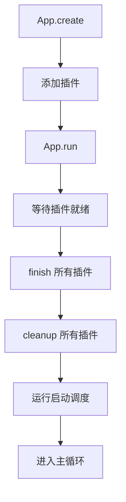
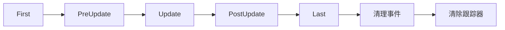

# 核心概念

## 架构概览

Bevy App 采用了三层架构设计：

```
┌─────────────────────────────────────────┐
│                   App                    │  <- 主应用程序
├─────────────────────────────────────────┤
│                 Plugins                  │  <- 插件层
├─────────────────────────────────────────┤
│      SubApps (Main + Custom)            │  <- 子应用层
├─────────────────────────────────────────┤
│           ECS World (Matter)            │  <- ECS 世界
└─────────────────────────────────────────┘
```

## 核心组件

### 1. App（应用程序）

App 是整个框架的入口点，负责：
- 管理应用程序生命周期
- 协调插件的加载和执行
- 管理子应用（SubApps）
- 提供资源和系统的注册接口

```typescript
const app = App.create();
app.addPlugin(myPlugin);
app.run();
```

### 2. Plugin（插件）

插件是功能模块化的基本单位。每个插件：
- 封装特定功能
- 可以添加系统、资源和其他插件
- 有明确的生命周期（build → ready → finish → cleanup）

```typescript
export class MyPlugin implements Plugin {
    build(app: App): void {
        // 配置应用
    }
    name(): string {
        return "MyPlugin";
    }
    isUnique(): boolean {
        return true;
    }
}
```

### 3. Schedule（调度）

调度器控制系统的执行时机和顺序：

#### 生命周期调度（只执行一次）
- **PreStartup** - 启动前的初始化
- **Startup** - 主要的启动逻辑
- **PostStartup** - 启动后的清理

#### 运行时调度（每帧执行）
- **First** - 帧开始时最先执行
- **PreUpdate** - 更新前的准备
- **Update** - 主要的游戏逻辑
- **PostUpdate** - 更新后的处理
- **Last** - 帧结束时最后执行

### 4. System（系统）

系统是包含游戏逻辑的函数：

```typescript
function mySystem(world: World, context: Context): void {
    // 系统逻辑
}

app.addSystems(Update, mySystem);
```

### 5. Resource（资源）

资源是全局共享的数据：

```typescript
class GameConfig {
    maxPlayers = 10;
    gameMode = "deathmatch";
}

app.insertResource(new GameConfig());
```

### 6. World（世界）

World 是 ECS 的核心，管理所有的实体和组件。基于 @rbxts/matter 实现。

## 执行流程

### 应用启动流程



### 主循环执行顺序



## 插件生命周期

插件有四个生命周期阶段：

1. **build(app)** - 插件初始化，添加系统和资源
2. **ready(app)** - 检查插件是否准备完成（可选）
3. **finish(app)** - 完成插件设置（可选）
4. **cleanup(app)** - 清理插件资源（可选）

状态转换：
```
Adding -> Ready -> Finished -> Cleaned
```

## Context（上下文）

Context 提供了访问核心功能的统一接口：

```typescript
function mySystem(world: World, context: Context): void {
    // 访问资源
    const config = context.getResource(GameConfig);

    // 发送事件
    context.sendEvent(PlayerJoined, { playerId: 123 });

    // 执行命令
    context.commands.spawn(/* ... */);
}
```

## Roblox 特性

### 平台区分

支持客户端/服务端代码分离：

```typescript
// 仅在服务端运行
app.addServerSystems(Update, serverOnlySystem);

// 仅在客户端运行
app.addClientSystems(Update, clientOnlySystem);

// 插件也可以指定平台
class ServerPlugin implements Plugin {
    robloxContext = RobloxContext.Server;
    // ...
}
```

### 事件集成

与 Roblox RunService 事件集成：

```typescript
const eventMapping = {
    [MainScheduleLabel.UPDATE]: RunService.Heartbeat,
    [MainScheduleLabel.RENDER]: RunService.RenderStepped,
};
```

## 与 Rust Bevy 的差异

1. **World 实现** - 使用 @rbxts/matter 而非 Rust 的 ECS
2. **内存管理** - 依赖 Luau 的垃圾回收
3. **并发模型** - 使用 Roblox 的协程而非 Rust 的线程
4. **平台特性** - 增加了 Roblox 特定的功能

## 最佳实践

1. **使用插件组织代码** - 将相关功能封装在插件中
2. **合理选择调度** - 根据系统的执行时机选择合适的调度
3. **避免在 Update 中执行重计算** - 使用 First/Last 进行初始化和清理
4. **资源优于组件** - 对于全局状态，使用资源而非单例实体
5. **利用系统依赖** - 使用 before/after 控制系统执行顺序