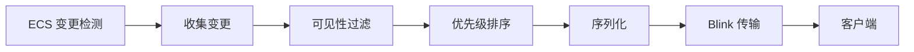
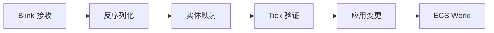

# Bevy Replicon 操作手册

## 目录

1. [模块概述](#模块概述)
2. [核心概念](#核心概念)
3. [架构设计](#架构设计)
4. [API 使用指南](#api-使用指南)
5. [网络协议](#网络协议)
6. [实体复制](#实体复制)
7. [组件同步](#组件同步)
8. [事件系统](#事件系统)
9. [可见性控制](#可见性控制)
10. [性能优化](#性能优化)
11. [最佳实践](#最佳实践)
12. [故障排除](#故障排除)

---

## 模块概述

### 1.1 项目状态

**当前状态**: 规划阶段，基础框架已完成

- ✅ **已完成**: bevy_app、bevy_ecs、bevy_time、bevy_diagnostic 等核心模块
- 🚧 **开发中**: roblox_blink_network（Roblox 网络层）
- 📋 **规划中**: bevy_replicon（网络复制框架）

### 1.2 模块定位

`bevy_replicon` 是一个**服务器权威的网络复制框架**,提供:

- 🎯 **自动实体同步**: 基于 ECS 变更检测自动复制实体和组件
- 🔒 **服务器权威**: 所有游戏状态由服务器控制,防止作弊
- 📡 **双向事件系统**: 客户端↔服务器 RPC 通信
- 👁️ **可见性控制**: 细粒度控制每个客户端可见的实体
- ⚡ **性能优化**: 优先级系统、增量更新、带宽控制

### 1.3 技术栈

| 组件 | 原版 Bevy Replicon | Roblox TypeScript 实现 |
|------|-------------------|----------------------|
| 语言 | Rust | TypeScript → Lua |
| ECS | Bevy ECS | Matter ECS |
| 网络 | 自定义后端 | Blink IDL + RemoteEvents |
| 序列化 | postcard | Blink Buffer |
| 时间系统 | Bevy Time | bevy_time (已完成) |
| 插件系统 | Bevy Plugins | bevy_app (已完成) |

### 1.4 依赖关系

```typescript
bevy_replicon
├── bevy_app           // ✅ 插件系统和调度器
├── bevy_ecs           // ✅ ECS 适配层
├── bevy_time          // ✅ Tick 系统
├── bevy_diagnostic    // ✅ 性能监控
└── roblox_blink_network // 🚧 网络传输层
```

---

## 核心概念

### 2.1 服务器权威模型

系统采用严格的服务器权威架构:

```typescript
┌─────────────┐                    ┌─────────────┐
│   客户端    │                    │   服务器    │
├─────────────┤                    ├─────────────┤
│  只读状态   │ ← 状态复制 ────── │ 游戏状态    │
│  发送输入   │ ── 输入事件 ────→ │ 验证+执行   │
└─────────────┘                    └─────────────┘
```

**关键原则**:
- ❌ 客户端**不能**直接修改游戏状态
- ✅ 客户端通过事件发送输入请求
- ✅ 服务器验证后更新状态并复制到客户端

### 2.2 Tick 系统

```typescript
// 利用现有的 bevy_time 系统
import { Time, FixedTime } from "../bevy_time";

class RepliconTick {
	private tickNumber: number = 0;

	constructor(private fixedTime: FixedTime) {}

	getCurrentTick(): number {
		// bevy_time 提供的 Tick 计数
		return this.fixedTime.overstepCount();
	}

	increment(): void {
		this.tickNumber++;
	}
}
```

**Tick 的作用**:
- ⏱️ 同步服务器和客户端的时间线
- 📦 确保消息按正确顺序处理
- 🔄 支持客户端预测和回滚

### 2.3 实体映射

服务器和客户端的实体 ID 不同,需要映射:

```typescript
class ServerEntityMap {
	private serverToClient = new Map<Entity, Entity>();
	private clientToServer = new Map<Entity, Entity>();

	insert(serverEntity: Entity, clientEntity: Entity): void {
		this.serverToClient.set(serverEntity, clientEntity);
		this.clientToServer.set(clientEntity, serverEntity);
	}

	toClient(serverEntity: Entity): Entity | undefined {
		return this.serverToClient.get(serverEntity);
	}

	toServer(clientEntity: Entity): Entity | undefined {
		return this.clientToServer.get(clientEntity);
	}
}
```

### 2.4 复制模式

| 模式 | 说明 | 使用场景 |
|-----|------|---------|
| FullUpdate | 每次变更都发送完整数据 | 小型组件,变化频繁 |
| Incremental | 只发送变化的字段 | 大型组件,部分字段变化 |
| OnceOnly | 只在生成时发送一次 | 不可变数据,如实体类型 |

---

## 架构设计

### 3.1 模块结构

```
src/bevy_replicon/
├── index.ts                    // 模块入口
├── plugin.ts                   // RepliconPlugin
├── client/                     // 客户端模块
│   ├── client-plugin.ts       // 客户端插件
│   ├── entity-mapper.ts       // 实体映射
│   ├── ack-manager.ts         // 确认管理
│   ├── mutation-tracker.ts    // 变更跟踪
│   └── event-receiver.ts      // 事件接收
├── server/                     // 服务器模块
│   ├── server-plugin.ts       // 服务器插件
│   ├── replication-buffer.ts  // 复制缓冲
│   ├── visibility-manager.ts  // 可见性管理
│   ├── priority-map.ts        // 优先级映射
│   └── event-sender.ts        // 事件发送
├── shared/                     // 共享模块
│   ├── tick-system.ts         // Tick 系统
│   ├── network-adapter.ts     // 网络适配器
│   ├── replication-rules.ts   // 复制规则
│   ├── event-system.ts        // 事件系统
│   └── types.ts              // 类型定义
└── __tests__/
    ├── replication.spec.ts
    ├── events.spec.ts
    └── visibility.spec.ts
```

### 3.2 数据流图

#### 服务器端复制流程



#### 客户端接收流程



### 3.3 系统集成

```typescript
import { App, Plugin, BuiltinSchedules } from "../bevy_app";
import { RobloxBlinkNetworkPlugin } from "../roblox_blink_network";

export class RepliconPlugin extends Plugin {
	build(app: App): void {
		// 依赖网络层
		if (!app.hasPlugin(RobloxBlinkNetworkPlugin)) {
			error("RepliconPlugin requires RobloxBlinkNetworkPlugin");
		}

		// 添加资源
		app.insertResource(new ServerTick());
		app.insertResource(new ServerEntityMap());
		app.insertResource(new ReplicationBuffer());

		// 添加系统
		if (RunService.IsServer()) {
			this.buildServer(app);
		} else {
			this.buildClient(app);
		}
	}

	private buildServer(app: App): void {
		app.addSystems(BuiltinSchedules.PreUpdate, [
			incrementServerTick,
			receiveClientEvents,
		]);

		app.addSystems(BuiltinSchedules.PostUpdate, [
			collectEntityChanges,
			filterByVisibility,
			applyPriority,
			sendReplicationMessages,
		]);
	}

	private buildClient(app: App): void {
		app.addSystems(BuiltinSchedules.PreUpdate, [
			receiveReplicationMessages,
			applyEntityUpdates,
		]);

		app.addSystems(BuiltinSchedules.PostUpdate, [
			sendClientEvents,
		]);
	}
}
```

---

## API 使用指南

### 4.1 基础配置

```typescript
import { App } from "./bevy_app";
import { RepliconPlugin } from "./bevy_replicon";

// 服务器应用
const serverApp = App.new()
	.addPlugin(new RobloxBlinkNetworkPlugin({ isServer: true }))
	.addPlugin(new RepliconPlugin())
	.run();

// 客户端应用
const clientApp = App.new()
	.addPlugin(new RobloxBlinkNetworkPlugin({ isServer: false }))
	.addPlugin(new RepliconPlugin())
	.run();
```

### 4.2 组件复制注册

#### 基础复制

```typescript
import { replicate } from "./bevy_replicon";

// 自动复制组件
@replicate()
class Health {
	constructor(
		public current: number,
		public maximum: number,
	) {}
}

// Matter 组件定义
const HealthComponent = component<Health>("Health");
```

#### 自定义序列化

```typescript
import { replicateWith } from "./bevy_replicon";

class Transform {
	constructor(
		public position: Vector3,
		public rotation: CFrame,
		public scale: Vector3,
	) {}
}

// 自定义序列化优化带宽
replicateWith<Transform>({
	componentType: Transform,
	serialize: (transform: Transform): buffer => {
		// 位置量化到厘米精度
		const quantizedX = math.floor(transform.position.X * 100);
		const quantizedY = math.floor(transform.position.Y * 100);
		const quantizedZ = math.floor(transform.position.Z * 100);

		// 使用 Blink buffer
		return serializeQuantizedTransform(quantizedX, quantizedY, quantizedZ);
	},
	deserialize: (data: buffer): Transform => {
		const [x, y, z] = deserializeQuantizedTransform(data);
		return new Transform(
			new Vector3(x / 100, y / 100, z / 100),
			new CFrame(),
			new Vector3(1, 1, 1),
		);
	},
});
```

#### 条件复制

```typescript
// 只复制带有 Player 标记的实体的 Health 组件
replicateFiltered<Health>({
	componentType: Health,
	filter: (entity: Entity, world: World): boolean => {
		return world.contains(entity, PlayerComponent);
	},
});
```

### 4.3 事件系统

#### 客户端到服务器事件

```typescript
// 1. 定义协议 (protocols/game/game.blink)
namespace Game

event PlayerInput {
	From: Client,
	Type: Reliable,
	Data: {
		moveDirection: vec3,
		jump: boolean,
		tick: u32
	}
}

// 2. 客户端发送
function sendPlayerInput(
	protocolManager: ProtocolManager,
	input: PlayerInputData,
): void {
	protocolManager.send("Game.PlayerInput", input);
}

// 3. 服务器接收
function receivePlayerInput(
	world: World,
	protocolManager: ProtocolManager,
): void {
	protocolManager.on("Game.PlayerInput", (data, player) => {
		// 验证输入
		if (!validateInput(data)) {
			warn(`Invalid input from player ${player.UserId}`);
			return;
		}

		// 获取玩家实体
		const entity = getPlayerEntity(world, player);
		if (!entity) return;

		// 应用移动
		const velocity = world.get(entity, VelocityComponent);
		if (velocity) {
			velocity.linear = data.moveDirection.mul(MOVE_SPEED);
		}

		// 处理跳跃
		if (data.jump) {
			handleJump(world, entity);
		}
	});
}
```

#### 服务器到客户端事件

```typescript
// 1. 定义协议
event DamageEvent {
	From: Server,
	Type: Reliable,
	Data: {
		targetEntity: u32,
		damage: f32,
		damageType: string
	}
}

// 2. 服务器发送
function broadcastDamage(
	protocolManager: ProtocolManager,
	targetEntity: Entity,
	damage: number,
	damageType: string,
): void {
	protocolManager.broadcast("Game.DamageEvent", {
		targetEntity: entityToNetworkId(targetEntity),
		damage,
		damageType,
	});
}

// 3. 客户端接收
function receiveDamageEvent(
	world: World,
	protocolManager: ProtocolManager,
): void {
	protocolManager.on("Game.DamageEvent", (data) => {
		const entity = networkIdToEntity(data.targetEntity);
		if (!entity) return;

		// 播放特效
		spawnDamageEffect(world, entity, data.damage);

		// 更新 UI
		updateHealthBar(entity, data.damage);
	});
}
```

### 4.4 可见性控制

#### 全局策略

```typescript
import { VisibilityPolicy } from "./bevy_replicon";

const app = App.new()
	.addPlugin(new RepliconPlugin({
		// 黑名单模式：默认可见，显式隐藏
		visibilityPolicy: VisibilityPolicy.Blacklist,

		// 白名单模式：默认隐藏，显式显示
		// visibilityPolicy: VisibilityPolicy.Whitelist,
	}))
	.run();
```

#### 动态可见性

```typescript
// 基于距离的可见性系统
function updateDistanceVisibility(
	world: World,
	visibilityManager: VisibilityManager,
): void {
	const VIEW_DISTANCE = 500;

	// 获取所有玩家
	const players = useHookState(world, "players", () => new Set<Entity>());

	for (const [playerEntity, playerTransform] of world.query(
		PlayerComponent,
		TransformComponent,
	)) {
		const visibility = visibilityManager.getClientVisibility(playerEntity);

		// 检查所有实体
		for (const [entity, transform] of world.query(
			TransformComponent,
			ReplicatedComponent,
		)) {
			const distance = playerTransform.position.sub(transform.position).Magnitude;

			if (distance < VIEW_DISTANCE) {
				visibility.setVisible(entity);
			} else {
				visibility.setHidden(entity);
			}
		}
	}
}

// 基于权限的可见性
function updatePermissionVisibility(
	world: World,
	visibilityManager: VisibilityManager,
): void {
	for (const [playerEntity] of world.query(PlayerComponent)) {
		const visibility = visibilityManager.getClientVisibility(playerEntity);
		const permissions = getPlayerPermissions(playerEntity);

		// 只显示玩家有权限查看的实体
		for (const [entity, restricted] of world.query(RestrictedComponent)) {
			if (permissions.includes(restricted.requiredPermission)) {
				visibility.setVisible(entity);
			} else {
				visibility.setHidden(entity);
			}
		}
	}
}
```

### 4.5 优先级系统

```typescript
import { PriorityMap } from "./bevy_replicon";

// 动态优先级系统
function updateReplicationPriority(
	world: World,
	priorityMap: PriorityMap,
): void {
	// 获取主玩家位置
	const mainPlayer = getMainPlayer(world);
	if (!mainPlayer) return;

	const mainPlayerTransform = world.get(mainPlayer, TransformComponent);
	if (!mainPlayerTransform) return;

	// 为所有实体设置优先级
	for (const [entity, transform] of world.query(
		TransformComponent,
		ReplicatedComponent,
	)) {
		const distance = mainPlayerTransform.position.sub(transform.position).Magnitude;

		// 距离越近，优先级越高
		let priority = 1.0;
		if (distance < 50) {
			priority = 1.0; // 每帧更新
		} else if (distance < 200) {
			priority = 0.5; // 每2帧更新
		} else if (distance < 500) {
			priority = 0.25; // 每4帧更新
		} else {
			priority = 0.1; // 每10帧更新
		}

		// 重要实体提升优先级
		if (world.contains(entity, ImportantComponent)) {
			priority *= 2.0;
		}

		priorityMap.set(entity, priority);
	}
}
```

---

## 网络协议

### 5.1 协议定义

```blink
// protocols/replicon/replicon.blink
namespace Replicon

// 基础类型
struct Vector3 {
	x: f32,
	y: f32,
	z: f32
}

struct ComponentData {
	componentId: string,
	data: buffer
}

// 实体操作
struct EntitySpawn {
	networkId: u32,
	components: ComponentData[]
}

struct EntityDespawn {
	networkId: u32
}

struct ComponentUpdate {
	networkId: u32,
	componentId: string,
	data: buffer
}

// 更新消息（可靠通道）
event ReliableUpdate {
	From: Server,
	Type: Reliable,
	Call: SingleAsync,
	Data: {
		tick: u32,
		spawns: EntitySpawn[],
		despawns: EntityDespawn[],
		insertions: ComponentUpdate[],
		removals: ComponentUpdate[]
	}
}

// 变更消息（不可靠通道）
event UnreliableUpdate {
	From: Server,
	Type: Unreliable,
	Call: SingleAsync,
	Data: {
		tick: u32,
		mutations: ComponentUpdate[]
	}
}

// 客户端确认
event ClientAck {
	From: Client,
	Type: Unreliable,
	Call: SingleAsync,
	Data: {
		lastReceivedTick: u32
	}
}
```

### 5.2 消息类型

#### Update 消息（可靠）

用于结构性变更:
- ✅ 实体生成/销毁
- ✅ 组件插入/移除
- ✅ 首次组件值

```typescript
interface UpdateMessage {
	tick: number;
	spawns: Array<{
		networkId: number;
		components: Array<ComponentData>;
	}>;
	despawns: number[];
	insertions: Array<{
		networkId: number;
		components: Array<ComponentData>;
	}>;
	removals: Array<{
		networkId: number;
		componentIds: string[];
	}>;
}
```

#### Mutation 消息（不可靠）

用于频繁变化的数据:
- ✅ 位置、旋转更新
- ✅ 生命值变化
- ✅ 其他连续变化的组件

```typescript
interface MutationMessage {
	tick: number;
	mutations: Array<{
		networkId: number;
		componentId: string;
		data: buffer;
	}>;
}
```

### 5.3 带宽优化

Blink 自动提供的优化:
- 📦 Buffer 序列化（比 JSON 快 1.6-3.7x）
- 🗜️ 智能压缩（减少 1000x 带宽）
- 🔢 类型优化（u8 vs u32）
- 📊 批量合并

---

## 实体复制

### 6.1 标记实体为可复制

```typescript
import { ReplicatedComponent } from "./bevy_replicon";

// 服务器生成可复制实体
function spawnPlayer(world: World, player: Player): Entity {
	const entity = world.spawn(
		ReplicatedComponent(),           // 标记为可复制
		PlayerComponent(player.UserId),
		TransformComponent(new Vector3(0, 10, 0)),
		HealthComponent(100, 100),
		VelocityComponent(),
	);

	print(`Spawned player entity ${entity} for ${player.Name}`);
	return entity;
}
```

### 6.2 实体生命周期

```typescript
// 服务器：实体创建
const entity = world.spawn(
	ReplicatedComponent(),
	TransformComponent(position),
);

// → 自动发送 EntitySpawn 消息到可见的客户端

// 客户端：自动接收并创建对应实体
// - 分配新的客户端实体 ID
// - 建立服务器ID ↔ 客户端ID 映射
// - 应用所有组件

// 服务器：实体销毁
world.despawn(entity);

// → 自动发送 EntityDespawn 消息

// 客户端：自动销毁对应实体
// - 根据映射查找客户端实体
// - 销毁实体
// - 清理映射关系
```

### 6.3 预生成实体（客户端预测）

```typescript
// 客户端预测实体生成
function predictBulletSpawn(
	world: World,
	entityMapper: ClientEntityMapper,
	position: Vector3,
	velocity: Vector3,
): Entity {
	// 生成预测的服务器实体 ID
	const predictedServerId = entityMapper.generatePredictedId();

	// 客户端立即创建实体
	const clientEntity = world.spawn(
		TransformComponent(position),
		VelocityComponent(velocity),
		PredictedComponent(predictedServerId), // 标记为预测实体
	);

	// 建立预测映射
	entityMapper.insertPredicted(predictedServerId, clientEntity);

	return clientEntity;
}

// 服务器确认后自动合并
// - 收到服务器的真实实体ID
// - 更新映射关系
// - 移除 PredictedComponent
// - 保留实体和组件数据
```

---

## 组件同步

### 7.1 变更检测

利用 Matter ECS 的 hooks 系统:

```typescript
import { useEvent } from "@rbxts/matter-hooks";

// 服务器：自动检测组件变更
function detectComponentChanges(world: World): ComponentChange[] {
	const changes: ComponentChange[] = [];

	// 监听组件添加
	useEvent(world, "componentAdded", (entity, component) => {
		if (!world.contains(entity, ReplicatedComponent)) return;

		changes.push({
			entity,
			componentId: getComponentId(component),
			changeType: "Inserted",
		});
	});

	// 监听组件移除
	useEvent(world, "componentRemoved", (entity, component) => {
		if (!world.contains(entity, ReplicatedComponent)) return;

		changes.push({
			entity,
			componentId: getComponentId(component),
			changeType: "Removed",
		});
	});

	// 监听组件变化（需要手动标记）
	// Matter 不自动检测组件值变化
	// 使用 Changed<T> 组件标记

	return changes;
}

// 手动标记组件变化
function updatePlayerHealth(world: World, entity: Entity, newHealth: number): void {
	const health = world.get(entity, HealthComponent);
	if (!health) return;

	health.current = newHealth;

	// 标记为已变更
	world.insert(entity, ChangedComponent(HealthComponent));
}
```

### 7.2 组件插入

```typescript
// 服务器：插入新组件
function addWeaponToPlayer(world: World, entity: Entity): void {
	world.insert(
		entity,
		WeaponComponent("Sword", 50),
	);
	// → 自动发送 ComponentInsert 消息
}

// 客户端：自动接收并应用
// - 反序列化组件数据
// - 插入到对应的客户端实体
```

### 7.3 组件更新

```typescript
// 服务器：更新组件值
function damagePlayer(world: World, entity: Entity, damage: number): void {
	const health = world.get(entity, HealthComponent);
	if (!health) return;

	health.current = math.max(0, health.current - damage);

	// 标记变更
	world.insert(entity, ChangedComponent(HealthComponent));

	// → 下一帧自动发送 ComponentMutation 消息
}

// 客户端：自动接收并应用
// - 反序列化新的组件值
// - 更新客户端实体的对应组件
```

### 7.4 组件移除

```typescript
// 服务器：移除组件
function removeWeapon(world: World, entity: Entity): void {
	world.remove(entity, WeaponComponent);
	// → 自动发送 ComponentRemove 消息
}

// 客户端：自动移除组件
```

---

## 事件系统

### 8.1 事件定义

使用 Blink IDL 定义事件协议:

```blink
// protocols/game/game.blink
namespace Game

// 客户端输入事件
event PlayerMove {
	From: Client,
	Type: Reliable,
	Call: SingleSync,
	Data: {
		direction: vec3,
		speed: f32,
		tick: u32
	}
}

// 服务器状态事件
event PlayerDied {
	From: Server,
	Type: Reliable,
	Call: SingleSync,
	Data: {
		playerId: u32,
		killerId: u32?,
		deathReason: string
	}
}

// 双向RPC
function RequestEquipItem {
	Yield: Coroutine,
	Data: {
		itemId: u32
	},
	Return: {
		success: boolean,
		errorMessage: string?
	}
}
```

### 8.2 发送事件

#### 客户端到服务器

```typescript
import { ProtocolManager } from "../roblox_blink_network";

// 客户端系统
function sendPlayerMoveSystem(
	world: World,
	protocolManager: ProtocolManager,
	tick: RepliconTick,
): void {
	const inputService = game.GetService("UserInputService");

	// 收集输入
	const direction = new Vector3(0, 0, 0);
	if (inputService.IsKeyDown(Enum.KeyCode.W)) {
		direction.add(new Vector3(0, 0, -1));
	}
	// ... 其他按键

	if (direction.Magnitude > 0) {
		// 发送到服务器
		protocolManager.send("Game.PlayerMove", {
			direction: direction.Unit,
			speed: 16,
			tick: tick.getCurrentTick(),
		});
	}
}
```

#### 服务器到客户端

```typescript
// 服务器系统
function broadcastPlayerDeathSystem(
	world: World,
	protocolManager: ProtocolManager,
): void {
	// 查询死亡事件
	for (const [entity, death] of world.query(DeathEventComponent)) {
		const playerId = getNetworkId(entity);
		const killerId = death.killer ? getNetworkId(death.killer) : undefined;

		// 广播给所有客户端
		protocolManager.broadcast("Game.PlayerDied", {
			playerId,
			killerId,
			deathReason: death.reason,
		});

		// 清理事件组件
		world.remove(entity, DeathEventComponent);
	}
}
```

### 8.3 接收事件

```typescript
// 服务器接收客户端事件
function receivePlayerMoveSystem(
	world: World,
	protocolManager: ProtocolManager,
): void {
	protocolManager.on("Game.PlayerMove", (data, player) => {
		// 验证输入
		if (data.direction.Magnitude > 1.1) {
			warn(`Invalid input from ${player?.UserId}: direction too large`);
			return;
		}

		// 获取玩家实体
		const entity = getPlayerEntity(world, player!);
		if (!entity) return;

		// 应用移动
		const velocity = world.get(entity, VelocityComponent);
		if (velocity) {
			velocity.linear = data.direction.mul(data.speed);
		}
	});
}

// 客户端接收服务器事件
function receivePlayerDeathSystem(
	world: World,
	protocolManager: ProtocolManager,
): void {
	protocolManager.on("Game.PlayerDied", (data) => {
		const entity = networkIdToEntity(data.playerId);
		if (!entity) return;

		// 播放死亡动画
		playDeathAnimation(world, entity);

		// 显示死亡UI
		showDeathScreen(data.killerId, data.deathReason);
	});
}
```

### 8.4 RPC 调用

```typescript
// 客户端发起RPC
async function equipItem(
	protocolManager: ProtocolManager,
	itemId: number,
): Promise<{ success: boolean; errorMessage?: string }> {
	// Blink 生成的 RPC 函数
	const result = await protocolManager.call("Game.RequestEquipItem", {
		itemId,
	});

	if (!result.success) {
		warn(`Failed to equip item: ${result.errorMessage}`);
	}

	return result;
}

// 服务器处理RPC
function handleEquipItemRequest(
	world: World,
	protocolManager: ProtocolManager,
): void {
	protocolManager.onCall("Game.RequestEquipItem", async (data, player) => {
		const entity = getPlayerEntity(world, player!);
		if (!entity) {
			return { success: false, errorMessage: "Player entity not found" };
		}

		// 验证物品是否存在
		const inventory = world.get(entity, InventoryComponent);
		if (!inventory || !inventory.hasItem(data.itemId)) {
			return { success: false, errorMessage: "Item not in inventory" };
		}

		// 装备物品
		equipItemToSlot(world, entity, data.itemId);

		return { success: true };
	});
}
```

---

## 可见性控制

### 9.1 全局可见性策略

```typescript
export enum VisibilityPolicy {
	Blacklist,  // 默认可见，显式隐藏
	Whitelist,  // 默认隐藏，显式显示
}

export class RepliconPlugin extends Plugin {
	constructor(
		private config: RepliconConfig = {
			visibilityPolicy: VisibilityPolicy.Blacklist,
		},
	) {
		super();
	}
}
```

### 9.2 客户端可见性管理

```typescript
export class ClientVisibility {
	private visibleEntities = new Set<Entity>();
	private hiddenEntities = new Set<Entity>();
	private policy: VisibilityPolicy;

	constructor(policy: VisibilityPolicy) {
		this.policy = policy;
	}

	setVisible(entity: Entity): void {
		if (this.policy === VisibilityPolicy.Blacklist) {
			this.hiddenEntities.delete(entity);
		} else {
			this.visibleEntities.add(entity);
		}
	}

	setHidden(entity: Entity): void {
		if (this.policy === VisibilityPolicy.Blacklist) {
			this.hiddenEntities.add(entity);
		} else {
			this.visibleEntities.delete(entity);
		}
	}

	isVisible(entity: Entity): boolean {
		if (this.policy === VisibilityPolicy.Blacklist) {
			return !this.hiddenEntities.has(entity);
		} else {
			return this.visibleEntities.has(entity);
		}
	}
}
```

### 9.3 可见性系统示例

#### 基于距离

```typescript
function updateDistanceBasedVisibility(
	world: World,
	visibilityManager: VisibilityManager,
): void {
	const VIEW_DISTANCE = 500;

	// 遍历所有玩家
	for (const [playerEntity, playerTransform] of world.query(
		PlayerComponent,
		TransformComponent,
	)) {
		const visibility = visibilityManager.getClientVisibility(playerEntity);

		// 检查所有可复制实体
		for (const [entity, transform] of world.query(
			ReplicatedComponent,
			TransformComponent,
		)) {
			if (entity === playerEntity) continue; // 跳过自己

			const distance = playerTransform.position
				.sub(transform.position)
				.Magnitude;

			if (distance <= VIEW_DISTANCE) {
				visibility.setVisible(entity);
			} else {
				visibility.setHidden(entity);
			}
		}
	}
}
```

#### 基于房间

```typescript
function updateRoomBasedVisibility(
	world: World,
	visibilityManager: VisibilityManager,
): void {
	// 遍历所有玩家
	for (const [playerEntity, room] of world.query(
		PlayerComponent,
		RoomComponent,
	)) {
		const visibility = visibilityManager.getClientVisibility(playerEntity);

		// 只显示同一房间的实体
		for (const [entity, entityRoom] of world.query(
			ReplicatedComponent,
			RoomComponent,
		)) {
			if (room.id === entityRoom.id) {
				visibility.setVisible(entity);
			} else {
				visibility.setHidden(entity);
			}
		}
	}
}
```

#### 基于权限

```typescript
function updatePermissionBasedVisibility(
	world: World,
	visibilityManager: VisibilityManager,
): void {
	for (const [playerEntity, permissions] of world.query(
		PlayerComponent,
		PermissionsComponent,
	)) {
		const visibility = visibilityManager.getClientVisibility(playerEntity);

		// 检查需要权限的实体
		for (const [entity, restricted] of world.query(
			ReplicatedComponent,
			RestrictedComponent,
		)) {
			if (permissions.has(restricted.requiredPermission)) {
				visibility.setVisible(entity);
			} else {
				visibility.setHidden(entity);
			}
		}
	}
}
```

### 9.4 可见性状态

```typescript
export enum VisibilityState {
	Hidden,   // 实体当前不可见
	Gained,   // 实体刚变为可见（需要发送完整状态）
	Visible,  // 实体持续可见（只发送变更）
}

// 在发送复制消息时使用状态
function sendReplicationForEntity(
	entity: Entity,
	state: VisibilityState,
): void {
	switch (state) {
		case VisibilityState.Gained:
			// 发送完整实体状态（EntitySpawn）
			sendFullEntityState(entity);
			break;

		case VisibilityState.Visible:
			// 只发送变更（ComponentMutation）
			sendEntityChanges(entity);
			break;

		case VisibilityState.Hidden:
			// 发送实体移除（EntityDespawn）
			sendEntityDespawn(entity);
			break;
	}
}
```

---

## 性能优化

### 10.1 优先级系统

```typescript
export class PriorityMap {
	private priorities = new Map<Entity, number>();
	private accumulators = new Map<Entity, number>();

	set(entity: Entity, priority: number): void {
		this.priorities.set(entity, priority);
		if (!this.accumulators.has(entity)) {
			this.accumulators.set(entity, 0);
		}
	}

	shouldUpdate(entity: Entity, deltaTime: number): boolean {
		const priority = this.priorities.get(entity) ?? 1.0;
		const accumulator = this.accumulators.get(entity) ?? 0;

		const newAccumulator = accumulator + priority * deltaTime;

		if (newAccumulator >= 1.0) {
			this.accumulators.set(entity, 0);
			return true;
		} else {
			this.accumulators.set(entity, newAccumulator);
			return false;
		}
	}
}

// 使用示例
function sendReplicationWithPriority(
	world: World,
	priorityMap: PriorityMap,
	deltaTime: number,
): void {
	for (const [entity] of world.query(ReplicatedComponent)) {
		if (priorityMap.shouldUpdate(entity, deltaTime)) {
			sendEntityUpdate(entity);
		}
	}
}
```

### 10.2 批处理

```typescript
export class ReplicationBuffer {
	private spawns: EntitySpawn[] = [];
	private despawns: number[] = [];
	private mutations: ComponentUpdate[] = [];

	addSpawn(entity: Entity, components: ComponentData[]): void {
		this.spawns.push({
			networkId: getNetworkId(entity),
			components,
		});
	}

	addDespawn(entity: Entity): void {
		this.despawns.push(getNetworkId(entity));
	}

	addMutation(entity: Entity, componentId: string, data: buffer): void {
		this.mutations.push({
			networkId: getNetworkId(entity),
			componentId,
			data,
		});
	}

	flush(protocolManager: ProtocolManager, tick: number): void {
		if (this.spawns.size() > 0 || this.despawns.size() > 0) {
			protocolManager.broadcast("Replicon.ReliableUpdate", {
				tick,
				spawns: this.spawns,
				despawns: this.despawns,
				insertions: [],
				removals: [],
			});
		}

		if (this.mutations.size() > 0) {
			protocolManager.broadcast("Replicon.UnreliableUpdate", {
				tick,
				mutations: this.mutations,
			});
		}

		// 清空缓冲
		this.spawns = [];
		this.despawns = [];
		this.mutations = [];
	}
}
```

### 10.3 带宽监控

```typescript
export class BandwidthMonitor {
	private bytesSent: number = 0;
	private startTime: number = os.clock();

	recordSent(bytes: number): void {
		this.bytesSent += bytes;
	}

	getAverageBandwidth(): number {
		const elapsed = os.clock() - this.startTime;
		return elapsed > 0 ? this.bytesSent / elapsed : 0;
	}

	reset(): void {
		this.bytesSent = 0;
		this.startTime = os.clock();
	}
}

// 添加到诊断系统
function reportBandwidthDiagnostics(
	diagnostics: Diagnostics,
	monitor: BandwidthMonitor,
): void {
	diagnostics.addMeasurement("network_bandwidth_bps", monitor.getAverageBandwidth());
}
```

### 10.4 LOD（细节层次）

```typescript
// 根据距离调整更新频率
function calculatePriorityByDistance(distance: number): number {
	if (distance < 50) {
		return 1.0;   // 每帧
	} else if (distance < 100) {
		return 0.5;   // 每2帧
	} else if (distance < 200) {
		return 0.25;  // 每4帧
	} else if (distance < 500) {
		return 0.1;   // 每10帧
	} else {
		return 0.05;  // 每20帧
	}
}

function updateLODSystem(
	world: World,
	priorityMap: PriorityMap,
): void {
	const mainPlayer = getMainPlayer(world);
	if (!mainPlayer) return;

	const mainTransform = world.get(mainPlayer, TransformComponent);
	if (!mainTransform) return;

	for (const [entity, transform] of world.query(
		ReplicatedComponent,
		TransformComponent,
	)) {
		const distance = mainTransform.position
			.sub(transform.position)
			.Magnitude;

		const priority = calculatePriorityByDistance(distance);
		priorityMap.set(entity, priority);
	}
}
```

---

## 最佳实践

### 11.1 组件设计

#### ✅ 好的做法

```typescript
// 小型、专注的组件
class Health {
	constructor(
		public current: number,
		public maximum: number,
	) {}
}

class Velocity {
	constructor(
		public linear: Vector3,
		public angular: Vector3,
	) {}
}

// 使用适当的数字类型
class PlayerScore {
	constructor(
		public score: number,      // f64 足够
		public kills: number,      // u16 足够（65535最大值）
		public deaths: number,     // u16 足够
	) {}
}
```

#### ❌ 应避免的做法

```typescript
// 过大的组件
class MegaComponent {
	health: number;
	position: Vector3;
	velocity: Vector3;
	inventory: Item[];
	skills: Skill[];
	// ... 太多字段
}

// 包含不必要的字段
class Transform {
	position: Vector3;
	rotation: CFrame;
	scale: Vector3;
	dirty: boolean;        // ❌ 客户端不需要
	lastUpdateTime: number; // ❌ 客户端不需要
}
```

### 11.2 网络安全

```typescript
// ✅ 始终验证客户端输入
function handlePlayerInput(
	world: World,
	data: PlayerInputData,
	player: Player,
): void {
	// 1. 验证数值范围
	if (data.speed > MAX_ALLOWED_SPEED) {
		warn(`Player ${player.UserId} sent invalid speed: ${data.speed}`);
		kickPlayer(player, "Invalid input");
		return;
	}

	// 2. 验证实体所有权
	const entity = getPlayerEntity(world, player);
	if (!entity || !isOwnedBy(entity, player)) {
		warn(`Player ${player.UserId} tried to control unowned entity`);
		return;
	}

	// 3. 验证冷却时间
	const cooldown = world.get(entity, AbilityCooldownComponent);
	if (cooldown && cooldown.isOnCooldown(data.abilityId)) {
		warn(`Player ${player.UserId} tried to use ability on cooldown`);
		return;
	}

	// 验证通过，执行操作
	executePlayerInput(world, entity, data);
}

// ✅ 限制客户端事件频率
class RateLimiter {
	private eventCounts = new Map<Player, Map<string, number>>();
	private readonly maxEventsPerSecond = 60;

	checkRateLimit(player: Player, eventName: string): boolean {
		const playerEvents = this.eventCounts.get(player) ?? new Map();
		const count = playerEvents.get(eventName) ?? 0;

		if (count >= this.maxEventsPerSecond) {
			warn(`Player ${player.UserId} exceeded rate limit for ${eventName}`);
			return false;
		}

		playerEvents.set(eventName, count + 1);
		this.eventCounts.set(player, playerEvents);
		return true;
	}

	reset(): void {
		this.eventCounts.clear();
	}
}
```

### 11.3 错误处理

```typescript
// 使用 Result 模式
interface Result<T> {
	success: boolean;
	value?: T;
	error?: string;
}

function safeDeserialize<T>(data: buffer): Result<T> {
	try {
		const value = deserialize<T>(data);
		return { success: true, value };
	} catch (err) {
		return {
			success: false,
			error: tostring(err),
		};
	}
}

// 优雅地处理网络错误
function handleReplicationMessage(message: UpdateMessage): void {
	for (const spawn of message.spawns) {
		const result = safeDeserialize<ComponentData[]>(spawn.components);

		if (!result.success) {
			warn(`Failed to deserialize spawn: ${result.error}`);
			continue; // 跳过这个实体，继续处理其他
		}

		applyEntitySpawn(spawn.networkId, result.value!);
	}
}
```

### 11.4 性能优化技巧

```typescript
// 1. 批量查询而非单个查询
// ❌ 低效
for (const entity of entities) {
	const health = world.get(entity, HealthComponent);
	const transform = world.get(entity, TransformComponent);
	// ...
}

// ✅ 高效
for (const [entity, health, transform] of world.query(
	HealthComponent,
	TransformComponent,
)) {
	// 直接使用组件
}

// 2. 避免频繁的字符串操作
// ❌ 低效
const eventName = `${namespace}.${name}`;

// ✅ 预先构建
const EVENT_PLAYER_MOVE = "Game.PlayerMove";

// 3. 重用缓冲区
class SerializationBuffer {
	private buffer: buffer = buffer.create(1024);
	private offset: number = 0;

	reset(): void {
		this.offset = 0;
	}

	write(data: number): void {
		buffer.writeu32(this.buffer, this.offset, data);
		this.offset += 4;
	}
}

// 4. 使用对象池
class EntityPool {
	private available: Entity[] = [];

	acquire(world: World): Entity {
		return this.available.pop() ?? world.spawn();
	}

	release(entity: Entity): void {
		this.available.push(entity);
	}
}
```

---

## 故障排除

### 12.1 常见问题

#### 实体未同步

**症状**: 服务器创建的实体在客户端不可见

**检查清单**:
1. ✅ 实体是否有 `ReplicatedComponent`?
2. ✅ 客户端的可见性设置是否正确?
3. ✅ 网络插件是否正常运行?
4. ✅ 协议是否正确编译?

**调试代码**:
```typescript
// 服务器
function debugReplication(world: World): void {
	const replicatedCount = world.query(ReplicatedComponent).size();
	print(`Replicated entities: ${replicatedCount}`);

	for (const [entity] of world.query(ReplicatedComponent)) {
		const networkId = getNetworkId(entity);
		print(`  Entity ${entity} → NetworkID ${networkId}`);
	}
}
```

#### 组件未更新

**症状**: 组件值变化但客户端未收到更新

**可能原因**:
1. 未标记组件为已变更 (`ChangedComponent`)
2. 优先级太低导致更新延迟
3. 可见性被隐藏

**解决方案**:
```typescript
// 确保标记变更
function updateHealth(world: World, entity: Entity, newHealth: number): void {
	const health = world.get(entity, HealthComponent);
	if (!health) return;

	health.current = newHealth;

	// 关键：标记变更
	world.insert(entity, ChangedComponent(HealthComponent));

	// 或使用辅助函数
	markComponentChanged(world, entity, HealthComponent);
}
```

#### 事件未接收

**症状**: 发送的事件在接收端没有触发

**检查清单**:
1. ✅ 事件协议是否正确定义?
2. ✅ `protocolManager.on()` 是否正确注册?
3. ✅ 命名空间和事件名是否匹配?
4. ✅ 网络连接是否正常?

**调试代码**:
```typescript
// 添加日志
protocolManager.on("Game.PlayerMove", (data, player) => {
	print(`Received PlayerMove from ${player?.Name}`);
	print(`  Direction: ${data.direction}`);
	print(`  Speed: ${data.speed}`);

	// 处理事件...
});
```

### 12.2 性能问题

#### 带宽过高

**症状**: 网络流量超过预期

**诊断**:
```typescript
// 添加带宽监控
const monitor = new BandwidthMonitor();

function monitorBandwidth(): void {
	const bandwidth = monitor.getAverageBandwidth();
	print(`Average bandwidth: ${bandwidth} bytes/sec`);

	if (bandwidth > MAX_BANDWIDTH) {
		warn("Bandwidth exceeded! Consider:");
		warn("  1. Reducing update frequency");
		warn("  2. Implementing LOD");
		warn("  3. Optimizing component serialization");
	}
}
```

**解决方案**:
1. 降低 Tick Rate
2. 实施优先级系统
3. 使用 LOD
4. 优化组件大小

#### CPU 过高

**症状**: 服务器或客户端 CPU 使用率过高

**诊断**:
```typescript
import { Diagnostics } from "../bevy_diagnostic";

function profileSystems(diagnostics: Diagnostics): void {
	const frameTime = diagnostics.getMeasurement("frame_time");
	const replicationTime = diagnostics.getMeasurement("replication_time");

	print(`Frame: ${frameTime}ms, Replication: ${replicationTime}ms`);
}
```

**解决方案**:
1. 减少复制实体数量
2. 优化查询（避免过滤器）
3. 批量处理而非单个处理
4. 使用对象池

### 12.3 调试工具

```typescript
// 启用详细日志
const DEBUG_REPLICATION = true;

if (DEBUG_REPLICATION) {
	// 记录所有复制操作
	function debugSendUpdate(entity: Entity, componentId: string): void {
		print(`[Replicon] Send update: Entity ${entity}, Component ${componentId}`);
	}

	function debugReceiveUpdate(networkId: number, componentId: string): void {
		print(`[Replicon] Receive update: NetworkID ${networkId}, Component ${componentId}`);
	}
}

// 网络诊断面板
class ReplicationDebugPanel {
	private enabled: boolean = true;

	render(): void {
		if (!this.enabled) return;

		// 使用 bevy_diagnostic 获取数据
		const stats = this.collectStats();

		// 渲染到屏幕
		this.renderStats(stats);
	}

	private collectStats(): ReplicationStats {
		return {
			entitiesReplicated: getReplicatedEntityCount(),
			bytesSentPerSecond: getBandwidth(),
			messagesPerSecond: getMessageRate(),
			averageLatency: getAverageLatency(),
		};
	}
}
```

---

## 附录

### A. 完整示例

```typescript
// 完整的多人游戏示例
import { App } from "./bevy_app";
import { RepliconPlugin } from "./bevy_replicon";
import { RobloxBlinkNetworkPlugin } from "./roblox_blink_network";

// 组件定义
@replicate()
class Transform {
	constructor(public position: Vector3) {}
}

@replicate()
class Health {
	constructor(
		public current: number,
		public maximum: number,
	) {}
}

// 服务器应用
const serverApp = App.new()
	.addPlugin(new RobloxBlinkNetworkPlugin({ isServer: true }))
	.addPlugin(new RepliconPlugin({
		visibilityPolicy: VisibilityPolicy.Blacklist,
	}))
	.addSystems(BuiltinSchedules.Update, [
		spawnPlayersSystem,
		movePlayersSystem,
		damageSystem,
		updateVisibilitySystem,
	])
	.addSystems(BuiltinSchedules.PostUpdate, [
		cleanupDeadPlayersSystem,
	])
	.run();

// 客户端应用
const clientApp = App.new()
	.addPlugin(new RobloxBlinkNetworkPlugin({ isServer: false }))
	.addPlugin(new RepliconPlugin())
	.addSystems(BuiltinSchedules.Update, [
		sendInputSystem,
		interpolateTransformsSystem,
		updateHealthUISystem,
	])
	.run();

// 系统实现
function spawnPlayersSystem(world: World): void {
	const Players = game.GetService("Players");

	for (const player of Players.GetPlayers()) {
		if (hasPlayerEntity(world, player)) continue;

		const entity = world.spawn(
			ReplicatedComponent(),
			PlayerComponent(player.UserId),
			Transform(new Vector3(0, 10, 0)),
			Health(100, 100),
		);

		registerPlayerEntity(world, player, entity);
		print(`Spawned player ${player.Name}`);
	}
}

function movePlayersSystem(
	world: World,
	protocolManager: ProtocolManager,
): void {
	protocolManager.on("Game.PlayerMove", (data, player) => {
		const entity = getPlayerEntity(world, player!);
		if (!entity) return;

		const transform = world.get(entity, Transform);
		if (!transform) return;

		// 应用移动
		transform.position = transform.position.add(
			data.direction.mul(data.speed * 0.016),
		);

		// 标记变更
		world.insert(entity, ChangedComponent(Transform));
	});
}

function updateVisibilitySystem(
	world: World,
	visibilityManager: VisibilityManager,
): void {
	const VIEW_DISTANCE = 500;

	for (const [playerEntity, playerTransform] of world.query(
		PlayerComponent,
		Transform,
	)) {
		const visibility = visibilityManager.getClientVisibility(playerEntity);

		for (const [entity, transform] of world.query(
			ReplicatedComponent,
			Transform,
		)) {
			if (entity === playerEntity) continue;

			const distance = playerTransform.position
				.sub(transform.position)
				.Magnitude;

			if (distance <= VIEW_DISTANCE) {
				visibility.setVisible(entity);
			} else {
				visibility.setHidden(entity);
			}
		}
	}
}
```

### B. 参考资源

- [Bevy Replicon 原始文档](https://github.com/projectharmonia/bevy_replicon)
- [Blink IDL 编译器](https://github.com/1Axen/blink)
- [Matter ECS](https://github.com/evaera/matter)
- [roblox-ts 文档](https://roblox-ts.com/)

### C. 版本信息

- **文档版本**: 1.0.0
- **更新日期**: 2025-09-28
- **状态**: 规划文档
- **作者**: Claude Code Assistant

---

**注意**: 本文档描述的是规划中的实现。实际 API 可能在开发过程中发生变化。